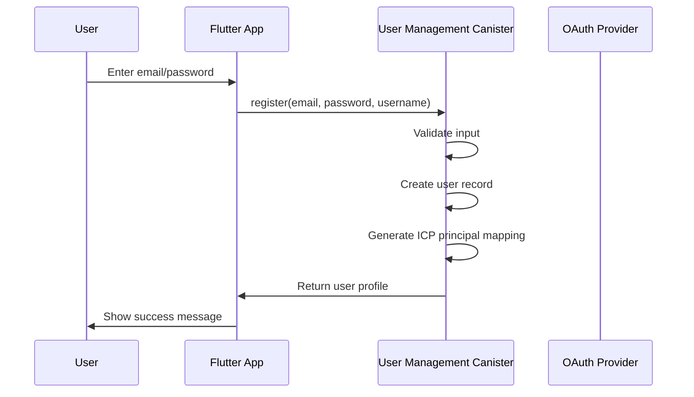
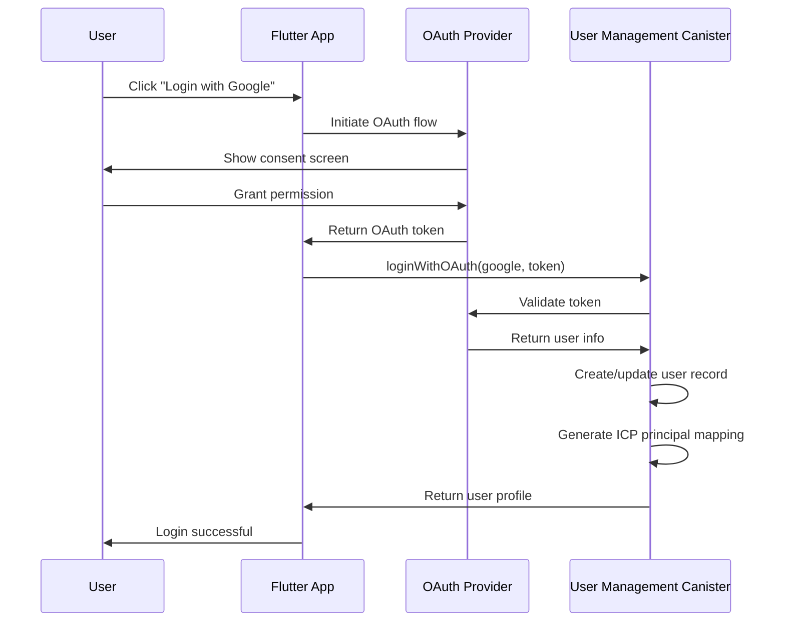
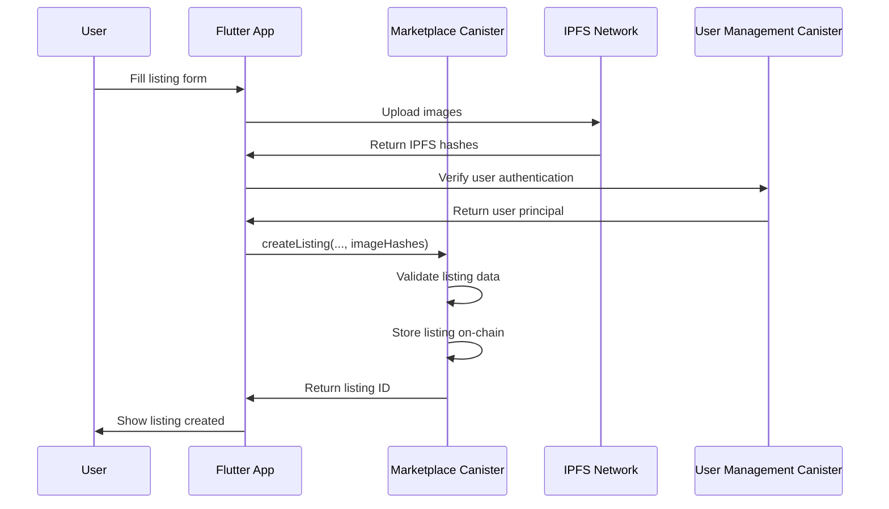
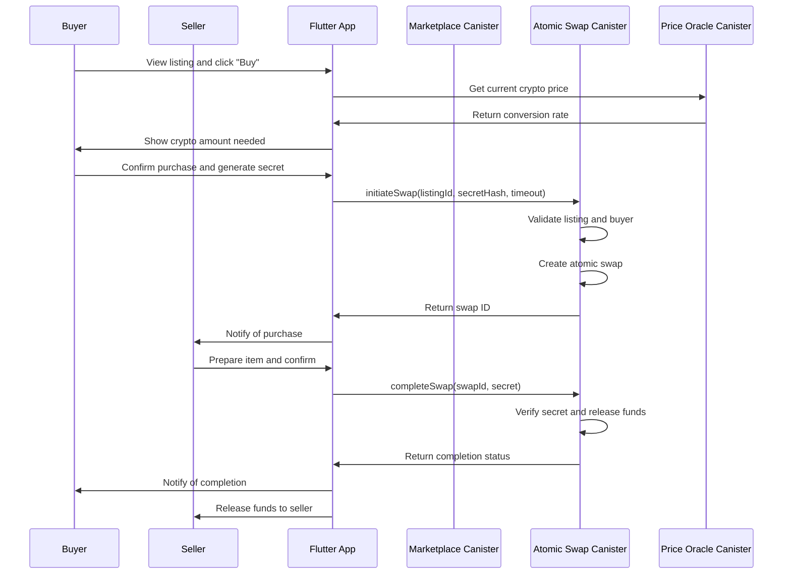
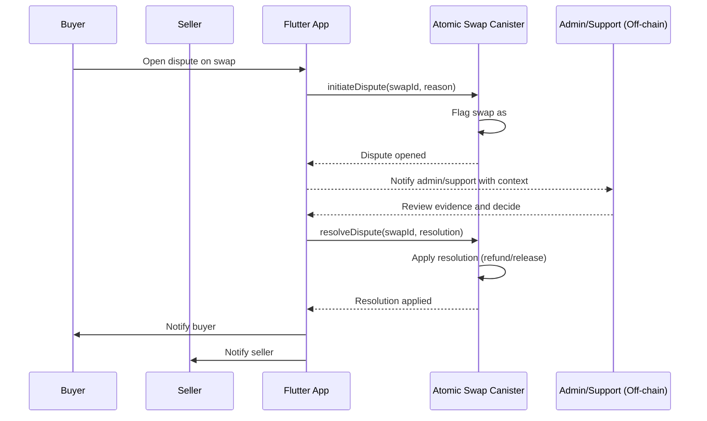

# **Core Workflows**

## **User Registration Flow**

```mermaid
sequenceDiagram
    participant U as User
    participant F as Flutter App
    participant UM as User Management Canister
    participant O as OAuth Provider

    U->>F: Enter email/password
    F->>UM: register(email, password, username)
    UM->>UM: Validate input
    UM->>UM: Create user record
    UM->>UM: Generate ICP principal mapping
    UM->>F: Return user profile
    F->>U: Show success message
```

## **OAuth Login Flow**

```mermaid
sequenceDiagram
    participant U as User
    participant F as Flutter App
    participant O as OAuth Provider
    participant UM as User Management Canister

    U->>F: Click "Login with Google"
    F->>O: Initiate OAuth flow
    O->>U: Show consent screen
    U->>O: Grant permission
    O->>F: Return OAuth token
    F->>UM: loginWithOAuth(google, token)
    UM->>O: Validate token
    O->>UM: Return user info
    UM->>UM: Create/update user record
    UM->>UM: Generate ICP principal mapping
    UM->>F: Return user profile
    F->>U: Login successful
```

## **Create Listing Flow**

```mermaid
sequenceDiagram
    participant U as User
    participant F as Flutter App
    participant M as Marketplace Canister
    participant IPFS as IPFS Network
    participant UM as User Management Canister

    U->>F: Fill listing form
    F->>IPFS: Upload images
    IPFS->>F: Return IPFS hashes
    F->>UM: Verify user authentication
    UM->>F: Return user principal
    F->>M: createListing(..., imageHashes)
    M->>M: Validate listing data
    M->>M: Store listing on-chain
    M->>F: Return listing ID
    F->>U: Show listing created
```

## **Atomic Swap Flow**

```mermaid
sequenceDiagram
    participant B as Buyer
    participant S as Seller
    participant F as Flutter App
    participant M as Marketplace Canister
    participant AS as Atomic Swap Canister
    participant PO as Price Oracle Canister

    B->>F: View listing and click "Buy"
    F->>PO: Get current crypto price
    PO->>F: Return conversion rate
    F->>B: Show crypto amount needed
    B->>F: Confirm purchase and generate secret
    F->>AS: initiateSwap(listingId, secretHash, timeout)
    AS->>AS: Validate listing and buyer
    AS->>AS: Create atomic swap
    AS->>F: Return swap ID
    F->>S: Notify of purchase
    S->>F: Prepare item and confirm
    F->>AS: completeSwap(swapId, secret)
    AS->>AS: Verify secret and release funds
    AS->>F: Return completion status
    F->>B: Notify of completion
    F->>S: Release funds to seller
```

## **Dispute Resolution Flow (MVP)**

```mermaid
sequenceDiagram
    participant B as Buyer
    participant S as Seller
    participant F as Flutter App
    participant AS as Atomic Swap Canister
    participant ADM as Admin/Support (Off-chain)

    B->>F: Open dispute on swap
    F->>AS: initiateDispute(swapId, reason)
    AS->>AS: Flag swap as #disputed
    AS-->>F: Dispute opened
    F-->>ADM: Notify admin/support with context
    ADM-->>F: Review evidence and decide
    F->>AS: resolveDispute(swapId, resolution)
    AS->>AS: Apply resolution (refund/release)
    AS-->>F: Resolution applied
    F->>B: Notify buyer
    F->>S: Notify seller
```
