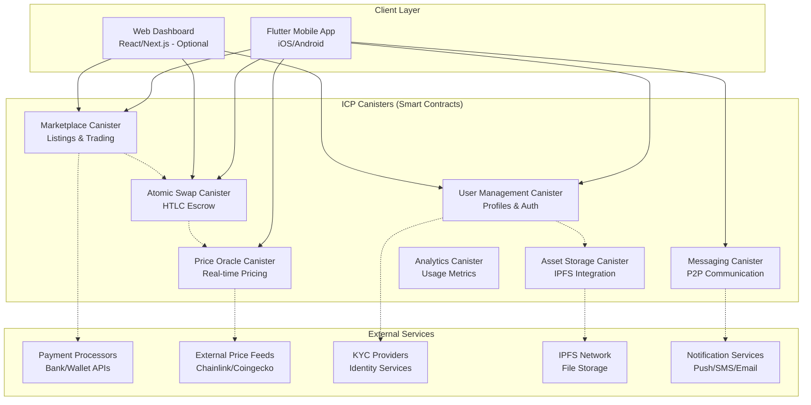
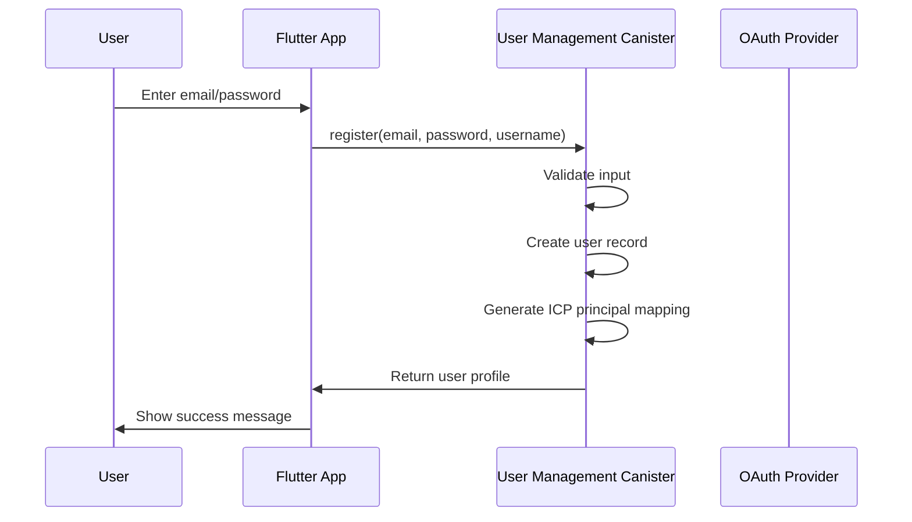
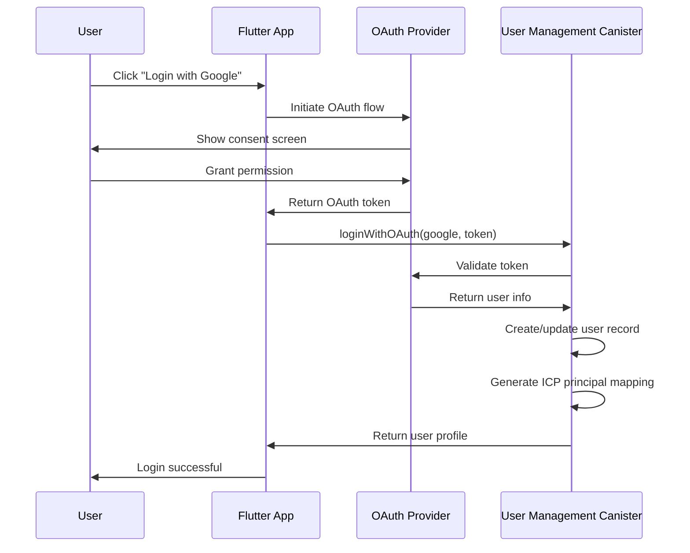
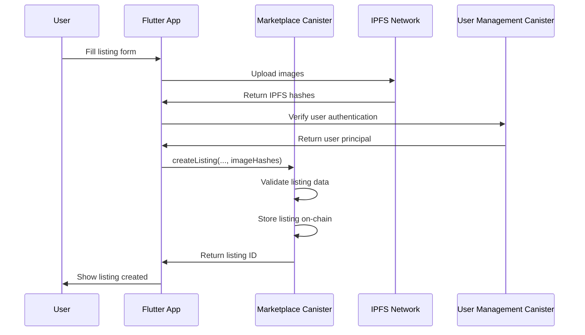
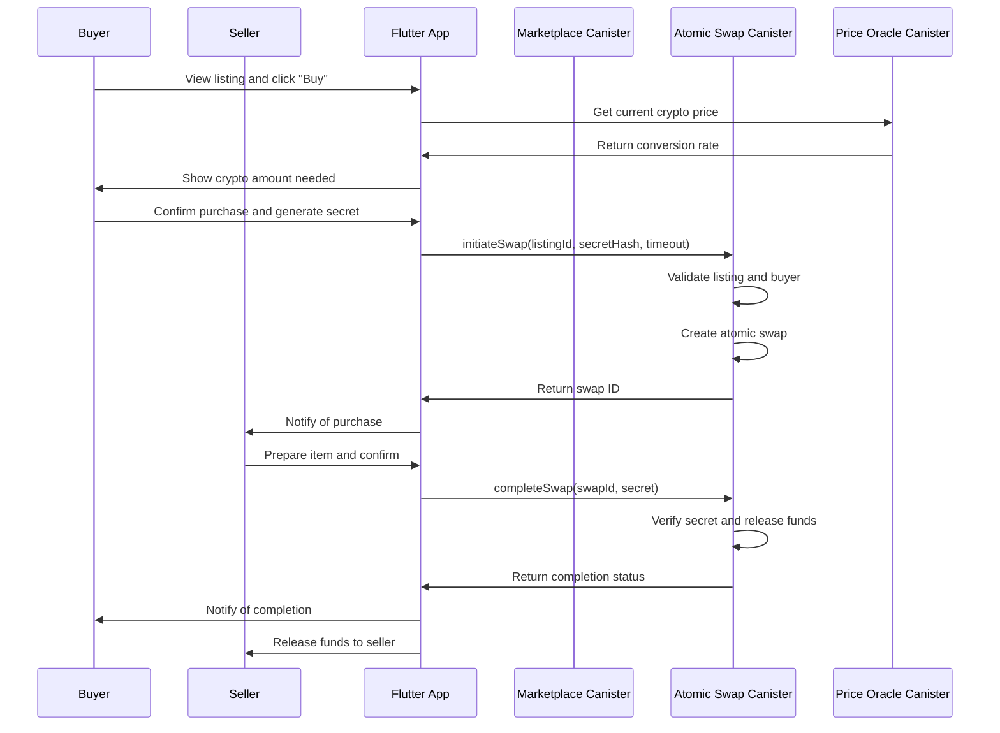
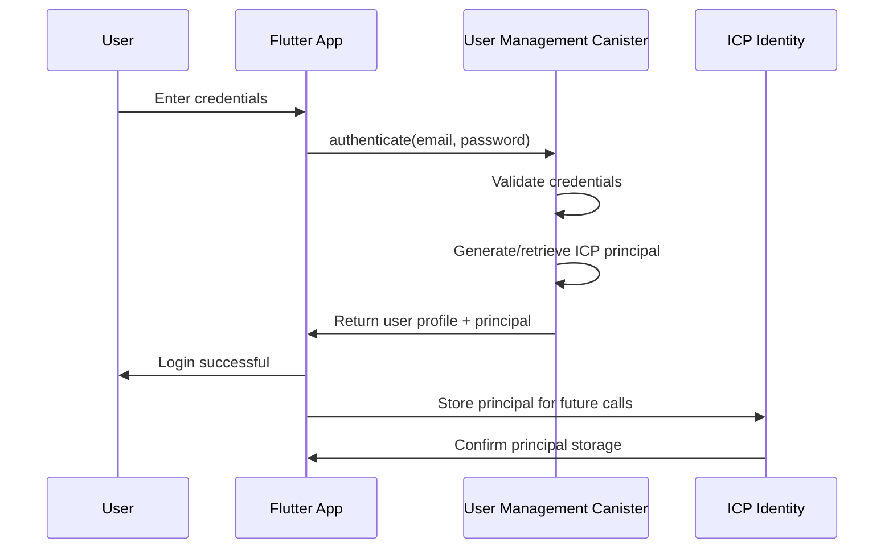
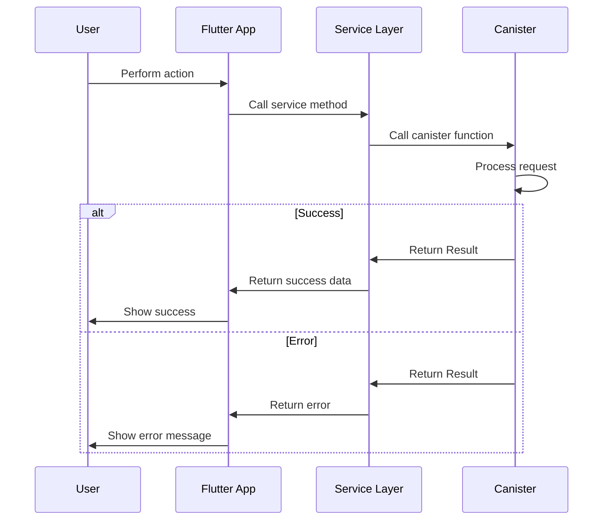

# Decentralized P2P Cryptocurrency Marketplace - Fullstack Architecture Document

## **Introduction**

This document outlines the complete fullstack architecture for the **Decentralized P2P Cryptocurrency Marketplace**, implementing a fully ICP-native approach where Flutter mobile apps communicate directly with Internet Computer canisters. This architecture eliminates traditional backend infrastructure entirely, providing true decentralization from day one.

### **Starter Template or Existing Project**

**Greenfield project** with ICP-native architecture:
- **Primary Stack**: Flutter/Dart (mobile) + ICP Canisters (backend)
- **Architecture Pattern**: Direct client-to-canister communication
- **Deployment Strategy**: ICP mainnet with optional CDN for static assets

### **Change Log**

| Date | Version | Description | Author |
|------|---------|-------------|--------|
| 2025-08-04 | 1.0 | Initial ICP-native architecture document | Winston (Architect) |

## **High Level Architecture**

### **Technical Summary**

This architecture implements a **fully ICP-native approach** where Flutter mobile apps communicate directly with Internet Computer canisters, eliminating the traditional backend entirely. All business logic, data persistence, authentication, and API endpoints run as smart contracts on ICP, providing true decentralization from day one with the option to add traditional backend components later only if performance issues arise.

### **Platform and Infrastructure Choice**

**Platform:** Internet Computer (Primary) + Optional CDN for static assets
**Key Services:** ICP Canisters (Smart Contracts), Cycles Management, Boundary Nodes, CDN (optional)
**Deployment Host and Regions:** ICP Mainnet + Geo-distributed canisters

**Rationale:**
- **True decentralization** from the start, no single point of control
- **No backend servers** to maintain or secure
- **Native Web3 integration** with ICP identity and wallet
- **Scalability** through ICP's automatic horizontal scaling
- **Performance** with sub-second finality and high throughput
- **Fallback option** to add traditional backend if needed

### **Repository Structure**

**Structure:** Monorepo with Flutter app + ICP canisters
**Monorepo Tool:** Nx workspace + DFX (ICP SDK)
**Package Organization:** Flutter mobile app + ICP canisters + shared types

### **Architecture Diagram - ICP Native**



### **Architectural Patterns**

- **Canister-Based Architecture:** Each logical component as separate canister - _Rationale:_ Enables independent scaling and deployment of different concerns
- **Direct Client-to-Canister Communication:** Flutter apps call canisters directly - _Rationale:_ Eliminates backend layer, reduces latency
- **ICP Identity Native Authentication:** Built-in Web3 authentication - _Rationale:_ No separate auth service needed
- **On-Chain Data Storage:** All data stored in canister state - _Rationale:_ True decentralization, no external database
- **Inter-Canister Communication:** Canisters communicate directly - _Rationale:_ Efficient intra-system communication
- **Cycles-Based Economics:** Pay-per-use model - _Rationale:_ Cost-efficient, scales with usage
- **Asset Offloading to IPFS:** Large files stored on IPFS - _Rationale:_ Cost-effective for large media/files

## **Tech Stack**

This is the DEFINITIVE technology selection for the entire project. All development must use these exact versions.

### **Technology Stack Table**

| Category | Technology | Version | Purpose | Rationale |
|----------|------------|---------|---------|-----------|
| Frontend Language | Dart | 3.4+ | Mobile app development | Type-safe, compiled, excellent performance |
| Frontend Framework | Flutter | 3.22+ | Cross-platform mobile apps | Single codebase for iOS/Android, hot reload |
| UI Component Library | Material Design | Built-in | Native UI components | Consistent platform-native look and feel |
| State Management | Riverpod | 2.4+ | State management | Simple, powerful, testable state management |
| Smart Contract Language | Motoko | Latest | ICP smart contracts | Native language for ICP, strong typing |
| Smart Contract Toolkit | DFX SDK | Latest | ICP development and deployment | Official ICP development toolkit |
| Authentication | Hybrid Auth | Custom | Traditional + ICP identity | Lower barrier to entry while maintaining decentralization |
| API Style | ICP Candid | Latest | Type-safe canister interfaces | Automatic type generation, language-agnostic |
| Database | ICP Canister Storage | Built-in | On-chain data persistence | True decentralization, built-in persistence |
| Cache | ICP Canister Memory | Built-in | In-memory caching | Fast access to frequently used data |
| File Storage | IPFS | Protocol | Large file storage | Decentralized, content-addressed storage |
| Cross-Chain | ICP Integration | Built-in | Multi-cryptocurrency support | Native cross-chain capabilities |
| Frontend Testing | Flutter Test | Built-in | Unit and widget tests | Integrated testing framework |
| Smart Contract Testing | Motoko Test | Built-in | Canister unit tests | Native testing for Motoko |
| E2E Testing | Flutter Driver | Latest | End-to-end testing | Real device simulation |
| Build Tool | Flutter CLI | Latest | Frontend builds | Official Flutter build system |
| Build Tool | DFX | Latest | Canister builds | Official ICP build system |
| Bundler | Flutter AOT | Latest | App compilation | Ahead-of-time compilation for performance |
| IaC Tool | DFX | Latest | Canister deployment | Native ICP deployment management |
| CI/CD | GitHub Actions | Latest | Automated builds and deployment | GitHub integration, free for public repos |
| Monitoring | ICP Dashboard | Built-in | Canister performance monitoring | Native ICP monitoring tools |
| Logging | ICP Canister Logs | Built-in | On-chain logging | Immutable, transparent audit trail |
| CSS Framework | Material Theme | Built-in | App styling | Consistent Material Design 3 |

## **Data Models**

### **User Model**

**Purpose:** Represents user accounts with hybrid authentication and reputation system

**Key Attributes:**
- id: Principal - ICP principal identifier
- username: Text - User display name
- email: Text - Email address (traditional auth)
- authProvider: Text - Authentication method (email, google, etc.)
- reputation: Nat - User reputation score
- createdAt: Int - Account creation timestamp
- lastLogin: Int - Last activity timestamp
- isActive: Bool - Account status
- kycVerified: Bool - KYC verification status
- profileImage: Text - IPFS hash of profile image

**TypeScript Interface:**
```typescript
interface User {
  id: Principal;
  username: string;
  email: string;
  authProvider: 'email' | 'google' | 'github' | 'apple';
  reputation: number;
  createdAt: bigint;
  lastLogin: bigint;
  isActive: boolean;
  kycVerified: boolean;
  profileImage?: string; // IPFS hash
}
```

**Relationships:**
- One-to-many: User creates many Listings
- One-to-many: User participates in many Atomic Swaps
- One-to-many: User sends many Messages
- One-to-many: User receives many Reputation ratings

### **Listing Model**

**Purpose:** Represents marketplace items for sale

**Key Attributes:**
- id: Nat - Unique listing identifier
- seller: Principal - Seller's principal
- title: Text - Item title
- description: Text - Item description
- priceUSD: Nat64 - Price in USD
- cryptoType: Text - Accepted cryptocurrency
- images: [Text] - Array of IPFS image hashes
- category: Text - Item category
- condition: Text - Item condition
- location: Text - Seller location
- shippingOptions: [Text] - Available shipping methods
- status: Text - Listing status
- createdAt: Int - Creation timestamp
- updatedAt: Int - Last update timestamp

**TypeScript Interface:**
```typescript
interface Listing {
  id: number;
  seller: Principal;
  title: string;
  description: string;
  priceUSD: bigint;
  cryptoType: string;
  images: string[];
  category: string;
  condition: 'new' | 'used' | 'refurbished';
  location: string;
  shippingOptions: string[];
  status: 'active' | 'pending' | 'sold' | 'cancelled';
  createdAt: bigint;
  updatedAt: bigint;
}
```

**Relationships:**
- Many-to-one: Listing belongs to one User
- One-to-many: Listing can have many Atomic Swaps
- One-to-many: Listing can have many Messages

### **Atomic Swap Model**

**Purpose:** Handles trustless cryptocurrency escrow for transactions

**Key Attributes:**
- id: Nat - Unique swap identifier
- listingId: Nat - Associated listing
- buyer: Principal - Buyer's principal
- seller: Principal - Seller's principal
- secretHash: [Nat8] - Hashed secret for HTLC
- secret: [Nat8] - Revealed secret (when completed)
- amount: Nat64 - Cryptocurrency amount
- cryptoType: Text - Cryptocurrency type
- timeout: Int - Timeout timestamp
- status: Text - Swap status
- createdAt: Int - Creation timestamp
- completedAt: Int - Completion timestamp

**TypeScript Interface:**
```typescript
interface AtomicSwap {
  id: number;
  listingId: number;
  buyer: Principal;
  seller: Principal;
  secretHash: Uint8Array;
  secret?: Uint8Array;
  amount: bigint;
  cryptoType: string;
  timeout: bigint;
  status: 'pending' | 'completed' | 'cancelled' | 'disputed';
  createdAt: bigint;
  completedAt?: bigint;
}
```

**Relationships:**
- Many-to-one: Atomic Swap belongs to one Listing
- Many-to-one: Atomic Swap initiated by one User (buyer)
- Many-to-one: Atomic Swap associated with one User (seller)

## **API Specification**

### **ICP Candid Interface**

Since we're using ICP canisters, the API is defined using Candid interface definition language. This provides type-safe communication between Flutter apps and canisters.

```candid
type Principal = Principal;
type Nat = Nat;
type Nat64 = Nat64;
type Int = Int;
type Text = Text;
type Bool = Bool;
type Timestamp = Int;

// User types
type User = {
  id: Principal;
  username: Text;
  email: Text;
  authProvider: Text;
  reputation: Nat;
  createdAt: Timestamp;
  lastLogin: Timestamp;
  isActive: Bool;
  kycVerified: Bool;
  profileImage: ?Text;
};

type AuthProvider = { #email; #google; #github; #apple };

// Listing types
type Listing = {
  id: Nat;
  seller: Principal;
  title: Text;
  description: Text;
  priceUSD: Nat64;
  cryptoType: Text;
  images: [Text];
  category: Text;
  condition: { #new; #used; #refurbished };
  location: Text;
  shippingOptions: [Text];
  status: { #active; #pending; #sold; #cancelled };
  createdAt: Timestamp;
  updatedAt: Timestamp;
};

// Atomic Swap types
type AtomicSwap = {
  id: Nat;
  listingId: Nat;
  buyer: Principal;
  seller: Principal;
  secretHash: [Nat8];
  secret: ?[Nat8];
  amount: Nat64;
  cryptoType: Text;
  timeout: Timestamp;
  status: { #pending; #completed; #cancelled; #disputed };
  createdAt: Timestamp;
  completedAt: ?Timestamp;
};

// Marketplace Canister
service : {
  // Listing management
  createListing : (title: Text, description: Text, priceUSD: Nat64, 
                   cryptoType: Text, images: [Text], category: Text,
                   condition: { #new; #used; #refurbished }, location: Text,
                   shippingOptions: [Text]) -> async (Result<Nat, Text>);
  getListing : (id: Nat) -> async (?Listing);
  getListings : (query: ?Text, category: ?Text, minPrice: ?Nat64, 
                 maxPrice: ?Nat64, limit: ?Nat) -> async ([Listing]);
  updateListing : (id: Nat, updates: ListingUpdate) -> async (Result<(), Text>);
  deleteListing : (id: Nat) -> async (Result<(), Text>);
  
  // User listings
  getUserListings : (user: Principal) -> async ([Listing]);
  
  // Categories
  getCategories : () -> async ([Text]);
};

// User Management Canister
service : {
  // Authentication
  authenticate : (email: Text, password: Text) -> async (Result<User, Text>);
  register : (email: Text, password: Text, username: Text) -> async (Result<User, Text>);
  loginWithOAuth : (provider: AuthProvider, token: Text) -> async (Result<User, Text>);
  
  // User management
  updateUserProfile : (updates: UserUpdate) -> async (Result<(), Text>);
  getUserProfile : (user: Principal) -> async (?User);
  verifyKYC : (kycData: KYCData) -> async (Result<(), Text>);
  
  // Reputation
  updateReputation : (user: Principal, change: Int) -> async (Result<(), Text>);
  getUserReputation : (user: Principal) -> async (Nat);
};

// Atomic Swap Canister
service : {
  // Swap operations
  initiateSwap : (listingId: Nat, secretHash: [Nat8], timeout: Timestamp) -> async (Result<Nat, Text>);
  completeSwap : (swapId: Nat, secret: [Nat8]) -> async (Result<(), Text>);
  refundSwap : (swapId: Nat) -> async (Result<(), Text>);
  cancelSwap : (swapId: Nat) -> async (Result<(), Text>);
  
  // Swap queries
  getSwap : (swapId: Nat) -> async (?AtomicSwap);
  getUserSwaps : (user: Principal) -> async ([AtomicSwap]);
  getListingSwaps : (listingId: Nat) -> async ([AtomicSwap]);
  
  // Dispute resolution
  initiateDispute : (swapId: Nat, reason: Text) -> async (Result<(), Text>);
  resolveDispute : (swapId: Nat, resolution: DisputeResolution) -> async (Result<(), Text>);
};

// Price Oracle Canister
service : {
  // Price updates
  updatePrice : (symbol: Text, priceUSD: Nat64, confidence: Nat8, source: Text) -> async (Result<(), Text>);
  
  // Price queries
  getPrice : (symbol: Text) -> async (?PriceData);
  getPrices : () -> async ([(Text, PriceData)]);
  getConversionAmount : (fromUSD: Nat64, toCrypto: Text) -> async (?Nat64);
  
  // Supported symbols
  getSupportedSymbols : () -> async ([Text]);
};
```

## **Components**

### **Marketplace Canister**

**Responsibility:** Core marketplace functionality including listing creation, management, and search

**Key Interfaces:**
- `createListing()` - Create new marketplace listing
- `getListing()` - Retrieve specific listing
- `getListings()` - Search and filter listings
- `updateListing()` - Update listing details
- `deleteListing()` - Remove listing

**Dependencies:** User Management Canister (for seller validation)

**Technology Stack:** Motoko smart contract on ICP

### **Atomic Swap Canister**

**Responsibility:** Handle trustless cryptocurrency escrow using HTLC (Hashed Timelock Contracts)

**Key Interfaces:**
- `initiateSwap()` - Create new atomic swap
- `completeSwap()` - Complete swap with secret
- `refundSwap()` - Refund after timeout
- `getSwap()` - Retrieve swap details
- `initiateDispute()` - Start dispute resolution

**Dependencies:** Marketplace Canister (listing validation), Price Oracle Canister (price validation)

**Technology Stack:** Motoko smart contract on ICP

### **User Management Canister**

**Responsibility:** User authentication, profile management, and reputation system

**Key Interfaces:**
- `authenticate()` - Traditional email/password authentication
- `register()` - User registration
- `loginWithOAuth()` - Social OAuth authentication
- `updateUserProfile()` - Profile updates
- `updateReputation()` - Reputation management

**Dependencies:** None (core service)

**Technology Stack:** Motoko smart contract on ICP

### **Price Oracle Canister**

**Responsibility:** Provide real-time cryptocurrency pricing data

**Key Interfaces:**
- `updatePrice()` - Update price from external sources
- `getPrice()` - Retrieve current price
- `getConversionAmount()` - Convert USD to crypto amount
- `getSupportedSymbols()` - Get supported cryptocurrencies

**Dependencies:** External price APIs (Chainlink, CoinGecko)

**Technology Stack:** Motoko smart contract on ICP

### **Messaging Canister**

**Responsibility:** Peer-to-peer communication between buyers and sellers

**Key Interfaces:**
- `sendMessage()` - Send message to another user
- `getMessages()` - Retrieve conversation history
- `markAsRead()` - Mark messages as read
- `deleteMessage()` - Remove messages

**Dependencies:** User Management Canister (user validation)

**Technology Stack:** Motoko smart contract on ICP

## **External APIs**

### **Chainlink Price Feeds API**

**Purpose:** Real-time cryptocurrency price data

**Documentation:** https://docs.chain.link/data-feeds/price-feeds/addresses

**Base URL(s):** https://feeds.chain.link/

**Authentication:** API key

**Rate Limits:** 100 requests per minute

**Key Endpoints Used:**
- `GET /price/{crypto_symbol}` - Current price data
- `GET /prices/{crypto_symbols}` - Batch price data

**Integration Notes:** ICP canisters will call this via HTTPS outcalls to update price oracle canister

### **CoinGecko API**

**Purpose:** Alternative cryptocurrency price data source

**Documentation:** https://www.coingecko.com/api/documentations/v3

**Base URL(s):** https://api.coingecko.com/api/v3

**Authentication:** Free tier (demo key)

**Rate Limits:** 10-50 requests per minute (free tier)

**Key Endpoints Used:**
- `GET /simple/price` - Simple price endpoint
- `GET /coins/markets` - Market data

**Integration Notes:** Secondary price source for redundancy

### **KYC Provider APIs**

**Purpose:** Identity verification services

**Documentation:** Provider-specific

**Base URL(s):** Provider-specific

**Authentication:** API keys and OAuth

**Rate Limits:** Provider-specific

**Key Endpoints Used:**
- `POST /verify` - Submit KYC verification
- `GET /status/{user_id}` - Check verification status

**Integration Notes:** Multiple providers for redundancy and geographic coverage

### **IPFS API**

**Purpose:** Decentralized file storage for images and documents

**Documentation:** https://docs.ipfs.io/reference/http/api/

**Base URL(s):** User's IPFS node or public gateway

**Authentication:** None (public IPFS)

**Rate Limits:** None (self-hosted) or provider limits

**Key Endpoints Used:**
- `POST /api/v0/add` - Upload file to IPFS
- `GET /api/v0/cat/{hash}` - Retrieve file from IPFS

**Integration Notes:** Used for storing large images and documents, with hashes stored on-chain

## **Core Workflows**

### **User Registration Flow**



### **OAuth Login Flow**



### **Create Listing Flow**



### **Atomic Swap Flow**



## **Database Schema**

### **On-Chain Data Storage**

Since we're using ICP canisters, all data is stored on-chain in canister state. Here's the conceptual data model:

#### **Marketplace Canister Storage**

```motoko
// User storage
private stable var users = Map.HashMap<Principal, User>();
private stable var userListings = Map.HashMap<Principal, List<Nat>>();
private stable var userReputation = Map.HashMap<Principal, Nat>();

// Listing storage
private stable var listings = Map.HashMap<Nat, Listing>();
private stable var categoryListings = Map.HashMap<Text, List<Nat>>();
private stable var activeListings = List<Nat>();
private stable var nextListingId = Nat = 1;

// Search indexes
private stable var titleIndex = Map.HashMap<Text, List<Nat>>();
private stable var priceIndex = Map.HashMap<Nat64, List<Nat>>();
private stable var locationIndex = Map.HashMap<Text, List<Nat>>();
```

#### **Atomic Swap Canister Storage**

```motoko
// Swap storage
private stable var swaps = Map.HashMap<Nat, AtomicSwap>();
private stable var userSwaps = Map.HashMap<Principal, List<Nat>>();
private stable var listingSwaps = Map.HashMap<Nat, List<Nat>>();
private stable var pendingSwaps = List<Nat>();
private stable var nextSwapId = Nat = 1;

// Security tracking
private stable var secretHashes = Set.Set<[Nat8]>();
private stable var swapLocks = Map.HashMap<[Nat8], Bool>();
```

#### **User Management Canister Storage**

```motoko
// User storage
private stable var users = Map.HashMap<Principal, User>();
private stable var emailUsers = Map.HashMap<Text, Principal>();
private stable var usernameUsers = Map.HashMap<Text, Principal>();
private stable var oauthUsers = Map.HashMap<Text, Principal>();

// Authentication
private stable var passwordHashes = Map.HashMap<Principal, [Nat8]>();
private stable var oauthTokens = Map.HashMap<Text, Principal>();
private stable var sessions = Map.HashMap<Text, Principal>();

// Security
private stable var failedAttempts = Map.HashMap<Principal, Nat>();
private stable var lockedAccounts = Set.Set<Principal>();
```

#### **Price Oracle Canister Storage**

```motoko
// Price storage
private stable var prices = Map.HashMap<Text, PriceData>();
private stable var priceHistory = Map.HashMap<Text, List<PriceData>>();
private stable var lastUpdate = Int = 0;

// Authorized updaters
private stable var authorizedUpdaters = Set.Set<Principal>();
private stable var updateHistory = List<PriceUpdate>();
```

## **Frontend Architecture**

### **Flutter App Structure**

```
crypto_marketplace/
├── lib/
│   ├── core/                    # Core services
│   │   ├── blockchain/          # ICP integration
│   │   │   ├── icp_service.dart
│   │   │   ├── canister_client.dart
│   │   │   └── auth_service.dart
│   │   ├── wallet/              # Wallet management
│   │   │   ├── wallet_service.dart
│   │   │   └── crypto_service.dart
│   │   ├── models/              # Data models
│   │   │   ├── user.dart
│   │   │   ├── listing.dart
│   │   │   └── atomic_swap.dart
│   │   └── utils/               # Utilities
│   │       ├── formatters.dart
│   │       ├── validators.dart
│   │       └── constants.dart
│   ├── features/                # Feature modules
│   │   ├── auth/               # Authentication
│   │   │   ├── screens/
│   │   │   │   ├── login_screen.dart
│   │   │   │   ├── register_screen.dart
│   │   │   │   └── profile_screen.dart
│   │   │   ├── widgets/
│   │   │   │   ├── auth_form.dart
│   │   │   │   └── profile_header.dart
│   │   │   └── providers/
│   │   │       └── auth_provider.dart
│   │   ├── marketplace/        # Marketplace
│   │   │   ├── screens/
│   │   │   │   ├── home_screen.dart
│   │   │   │   ├── listing_detail_screen.dart
│   │   │   │   └── create_listing_screen.dart
│   │   │   ├── widgets/
│   │   │   │   ├── listing_card.dart
│   │   │   │   ├── search_bar.dart
│   │   │   │   └── filter_chip.dart
│   │   │   └── providers/
│   │   │       └── marketplace_provider.dart
│   │   ├── trading/           # Trading/Atomic Swaps
│   │   │   ├── screens/
│   │   │   │   ├── swap_screen.dart
│   │   │   │   ├── swap_detail_screen.dart
│   │   │   │   └── dispute_screen.dart
│   │   │   ├── widgets/
│   │   │   │   ├── swap_progress.dart
│   │   │   │   └── secret_input.dart
│   │   │   └── providers/
│   │   │       └── trading_provider.dart
│   │   └── messaging/          # Messaging
│   │       ├── screens/
│   │       │   ├── chat_screen.dart
│   │       │   └── conversation_list_screen.dart
│   │       ├── widgets/
│   │       │   ├── message_bubble.dart
│   │       │   └── chat_input.dart
│   │       └── providers/
│   │           └── messaging_provider.dart
│   ├── shared/                  # Shared components
│   │   ├── widgets/             # Reusable UI
│   │   │   ├── loading_overlay.dart
│   │   │   ├── error_dialog.dart
│   │   │   └── success_snackbar.dart
│   │   ├── theme/               # App theme
│   │   │   ├── app_theme.dart
│   │   │   └── colors.dart
│   │   └── localization/        # Internationalization
│   │       └── app_localizations.dart
│   └── main.dart               # App entry point
├── assets/                      # App assets
│   ├── images/
│   ├── icons/
│   └── fonts/
├── android/                     # Android build configuration
├── ios/                         # iOS build configuration
├── pubspec.yaml                 # Dependencies
└── README.md
```

### **State Management Architecture**

**State Structure:**
```dart
// Global app state
class AppState {
  final User? currentUser;
  final bool isLoading;
  final String? error;
  final ThemeMode themeMode;
  final Locale locale;
  
  const AppState({
    this.currentUser,
    this.isLoading = false,
    this.error,
    this.themeMode = ThemeMode.system,
    this.locale = const Locale('en'),
  });
  
  AppState copyWith({
    User? currentUser,
    bool? isLoading,
    String? error,
    ThemeMode? themeMode,
    Locale? locale,
  }) {
    return AppState(
      currentUser: currentUser ?? this.currentUser,
      isLoading: isLoading ?? this.isLoading,
      error: error ?? this.error,
      themeMode: themeMode ?? this.themeMode,
      locale: locale ?? this.locale,
    );
  }
}

// Authentication state
class AuthState {
  final User? user;
  final bool isAuthenticated;
  final bool isLoading;
  final String? error;
  
  const AuthState({
    this.user,
    this.isAuthenticated = false,
    this.isLoading = false,
    this.error,
  });
  
  AuthState copyWith({
    User? user,
    bool? isAuthenticated,
    bool? isLoading,
    String? error,
  }) {
    return AuthState(
      user: user ?? this.user,
      isAuthenticated: isAuthenticated ?? this.isAuthenticated,
      isLoading: isLoading ?? this.isLoading,
      error: error ?? this.error,
    );
  }
}
```

**State Management Patterns:**
- **Riverpod Providers**: Global state management with dependency injection
- **StateNotifier Classes**: Encapsulated state logic with proper separation of concerns
- **Async Providers**: Automatic handling of loading/error states for async operations
- **Family Modifiers**: Parameterized providers for reusable state logic

### **Routing Architecture**

**Route Organization:**
```dart
// App routes
final appRouter = GoRouter(
  routes: [
    GoRoute(
      path: '/',
      builder: (context, state) => const HomeScreen(),
      routes: [
        GoRoute(
          path: 'login',
          builder: (context, state) => const LoginScreen(),
        ),
        GoRoute(
          path: 'register',
          builder: (context, state) => const RegisterScreen(),
        ),
        GoRoute(
          path: 'profile',
          builder: (context, state) => const ProfileScreen(),
        ),
        GoRoute(
          path: 'listing/:id',
          builder: (context, state) => ListingDetailScreen(
            listingId: int.parse(state.pathParameters['id']!),
          ),
        ),
        GoRoute(
          path: 'create-listing',
          builder: (context, state) => const CreateListingScreen(),
        ),
        GoRoute(
          path: 'swap/:id',
          builder: (context, state) => SwapDetailScreen(
            swapId: int.parse(state.pathParameters['id']!),
          ),
        ),
        GoRoute(
          path: 'chat/:userId',
          builder: (context, state) => ChatScreen(
            userId: state.pathParameters['userId']!,
          ),
        ),
      ],
    ),
  ],
  errorBuilder: (context, state) => const ErrorScreen(),
);
```

**Protected Route Pattern:**
```dart
class ProtectedRoute extends StatelessWidget {
  final Widget child;
  
  const ProtectedRoute({required this.child, super.key});
  
  @override
  Widget build(BuildContext context, WidgetRef ref) {
    final authState = ref.watch(authProvider);
    
    if (authState.isLoading) {
      return const LoadingScreen();
    }
    
    if (!authState.isAuthenticated) {
      return const LoginScreen();
    }
    
    return child;
  }
}
```

### **Frontend Services Layer**

**ICP Client Setup:**
```dart
class ICPService {
  late final HttpClient _httpClient;
  late final AuthProvider _authProvider;
  
  // Canister clients
  late final Actor _marketplaceActor;
  late final Actor _userManagementActor;
  late final Actor _atomicSwapActor;
  late final Actor _priceOracleActor;
  
  ICPService(this._authProvider) {
    _httpClient = HttpClient();
    _initializeActors();
  }
  
  Future<void> _initializeActors() async {
    final canisterIds = await _loadCanisterIds();
    
    // Initialize marketplace actor
    _marketplaceActor = Actor(
      canisterId: canisterIds['marketplace']!,
      interfaceFactory: marketplaceFactory,
    );
    
    // Initialize other actors...
  }
  
  Future<Map<String, String>> _loadCanisterIds() async {
    // Load canister IDs from local config or ICP network
    return {
      'marketplace': 'rrkah-fqaaa-aaaaa-aaaaq-cai',
      'user_management': 'ryjl3-tyaaa-aaaaa-aaaba-cai',
      'atomic_swap': 'r7inp-6aaaa-aaaaa-aaabq-cai',
      'price_oracle': 'rkp4c-7iaaa-aaaaa-aaaca-cai',
    };
  }
}
```

**Service Example:**
```dart
class MarketplaceService {
  final ICPService _icpService;
  final Ref _ref;
  
  MarketplaceService(this._icpService, this._ref);
  
  Future<Listing> createListing({
    required String title,
    required String description,
    required BigInt priceUSD,
    required String cryptoType,
    required List<String> images,
    required String category,
    required String condition,
    required String location,
    required List<String> shippingOptions,
  }) async {
    try {
      final result = await _icpService.marketplaceActor.createListing(
        title,
        description,
        priceUSD,
        cryptoType,
        images,
        category,
        condition,
        location,
        shippingOptions,
      );
      
      if (result.err != null) {
        throw Exception(result.err);
      }
      
      return _mapListingFromResponse(result.ok);
    } catch (e) {
      throw Exception('Failed to create listing: $e');
    }
  }
  
  Future<List<Listing>> getListings({
    String? query,
    String? category,
    BigInt? minPrice,
    BigInt? maxPrice,
    int? limit,
  }) async {
    try {
      final result = await _icpService.marketplaceActor.getListings(
        query,
        category,
        minPrice,
        maxPrice,
        limit,
      );
      
      return result.map(_mapListingFromResponse).toList();
    } catch (e) {
      throw Exception('Failed to get listings: $e');
    }
  }
  
  Listing _mapListingFromResponse(Map<String, dynamic> response) {
    return Listing(
      id: response['id'],
      seller: Principal.fromText(response['seller']),
      title: response['title'],
      description: response['description'],
      priceUSD: response['priceUSD'],
      cryptoType: response['cryptoType'],
      images: List<String>.from(response['images']),
      category: response['category'],
      condition: response['condition'],
      location: response['location'],
      shippingOptions: List<String>.from(response['shippingOptions']),
      status: response['status'],
      createdAt: response['createdAt'],
      updatedAt: response['updatedAt'],
    );
  }
}
```

## **Backend Architecture**

### **Canister-Based Service Architecture**

Since we're using ICP canisters as the backend, the architecture is canister-based rather than traditional server-based.

#### **Marketplace Canister Implementation**

**Function Organization:**
```
marketplace_canister/
├── src/
│   ├── main.mo                 # Main canister actor
│   ├── types.mo                # Type definitions
│   ├── utils.mo                # Utility functions
│   ├── validation.mo           # Input validation
│   └── search.mo               # Search and filtering
├── test/
│   ├── marketplace_test.mo     # Unit tests
│   └── integration_test.mo     # Integration tests
└── dfx.json                   # DFX configuration
```

**Canister Template:**
```motoko
// Main canister actor
actor Marketplace {
  // Type definitions
  public type Listing = {
    id: Nat;
    seller: Principal;
    title: Text;
    description: Text;
    priceUSD: Nat64;
    cryptoType: Text;
    images: [Text];
    category: Text;
    condition: { #new; #used; #refurbished };
    location: Text;
    shippingOptions: [Text];
    status: { #active; #pending; #sold; #cancelled };
    createdAt: Int;
    updatedAt: Int;
  };
  
  // Storage
  private stable var listings = Map.HashMap<Nat, Listing>();
  private stable var userListings = Map.HashMap<Principal, List<Nat>>();
  private stable var categoryListings = Map.HashMap<Text, List<Nat>>();
  private stable var nextListingId = Nat = 1;
  
  // Security
  private stable var owner = Principal.fromText("2vxsx-fae");
  private stable var paused = false;
  
  // Rate limiting
  private stable var userActions = Map.HashMap<Principal, Int>();
  private stable var lastActionTime = Map.HashMap<Principal, Int>();
  
  // Public functions
  public shared ({ caller }) func createListing(
    title: Text,
    description: Text,
    priceUSD: Nat64,
    cryptoType: Text,
    images: [Text],
    category: Text,
    condition: { #new; #used; #refurbished },
    location: Text,
    shippingOptions: [Text]
  ) : async Result.Result<Nat, Text> {
    // Check if paused
    if (paused) {
      return #err("Marketplace is paused");
    };
    
    // Rate limiting
    if (not _checkRateLimit(caller)) {
      return #err("Rate limit exceeded");
    };
    
    // Input validation
    let validationResult = _validateListingInput(
      title, description, priceUSD, cryptoType, 
      images, category, condition, location, shippingOptions
    );
    
    switch (validationResult) {
      case (#err(msg)) { return #err(msg); };
      case (#ok) { /* Continue */ };
    };
    
    // Create listing
    let listingId = nextListingId;
    nextListingId += 1;
    
    let listing : Listing = {
      id = listingId;
      seller = caller;
      title = title;
      description = description;
      priceUSD = priceUSD;
      cryptoType = cryptoType;
      images = images;
      category = category;
      condition = condition;
      location = location;
      shippingOptions = shippingOptions;
      status = #active;
      createdAt = Time.now();
      updatedAt = Time.now();
    };
    
    // Store listing
    listings.put(listingId, listing);
    
    // Update indexes
    _updateUserListings(caller, listingId);
    _updateCategoryListings(category, listingId);
    
    return #ok(listingId);
  };
  
  // Query functions
  public query func getListing(id: Nat) : async ?Listing {
    return listings.get(id);
  };
  
  public query func getListings(
    query: ?Text,
    category: ?Text,
    minPrice: ?Nat64,
    maxPrice: ?Nat64,
    limit: ?Nat
  ) : async [Listing] {
    var results = List.nil<Listing>();
    
    // Filter logic here...
    
    return List.toArray(results);
  };
  
  // Private helper functions
  private func _checkRateLimit(user: Principal) : Bool {
    // Rate limiting implementation
    return true;
  };
  
  private func _validateListingInput(...) : Result.Result<(), Text> {
    // Input validation implementation
    return #ok;
  };
  
  private func _updateUserListings(user: Principal, listingId: Nat) {
    // Update user listings index
  };
  
  private func _updateCategoryListings(category: Text, listingId: Nat) {
    // Update category listings index
  };
  
  // Emergency functions
  public shared ({ caller }) func pause() : async Bool {
    assert(caller == owner);
    paused := true;
    return true;
  };
  
  public shared ({ caller }) func unpause() : async Bool {
    assert(caller == owner);
    paused := false;
    return true;
  };
};
```

### **Database Architecture**

**On-Chain Schema Design:**
```motoko
// User schema
public type User = {
  id: Principal;
  username: Text;
  email: Text;
  authProvider: Text;
  reputation: Nat;
  createdAt: Int;
  lastLogin: Int;
  isActive: Bool;
  kycVerified: Bool;
  profileImage: ?Text;
};

// Listing schema
public type Listing = {
  id: Nat;
  seller: Principal;
  title: Text;
  description: Text;
  priceUSD: Nat64;
  cryptoType: Text;
  images: [Text];
  category: Text;
  condition: { #new; #used; #refurbished };
  location: Text;
  shippingOptions: [Text];
  status: { #active; #pending; #sold; #cancelled };
  createdAt: Int;
  updatedAt: Int;
};

// Atomic swap schema
public type AtomicSwap = {
  id: Nat;
  listingId: Nat;
  buyer: Principal;
  seller: Principal;
  secretHash: [Nat8];
  secret: ?[Nat8];
  amount: Nat64;
  cryptoType: Text;
  timeout: Int;
  status: { #pending; #completed; #cancelled; #disputed };
  createdAt: Int;
  completedAt: ?Int;
};
```

**Data Access Layer (Repository Pattern):**
```motoko
// User repository
module UserRepository {
  public func createUser(user: User) : Result.Result<(), Text> {
    // Implementation
  };
  
  public func getUser(id: Principal) : ?User {
    // Implementation
  };
  
  public func updateUser(id: Principal, updates: UserUpdate) : Result.Result<(), Text> {
    // Implementation
  };
  
  public func deleteUser(id: Principal) : Result.Result<(), Text> {
    // Implementation
  };
  
  public func getUsersByCriteria(criteria: UserCriteria) : [User] {
    // Implementation
  };
};

// Listing repository
module ListingRepository {
  public func createListing(listing: Listing) : Result.Result<Nat, Text> {
    // Implementation
  };
  
  public func getListing(id: Nat) : ?Listing {
    // Implementation
  };
  
  public func updateListing(id: Nat, updates: ListingUpdate) : Result.Result<(), Text> {
    // Implementation
  };
  
  public func deleteListing(id: Nat) : Result.Result<(), Text> {
    // Implementation
  };
  
  public func searchListings(query: SearchQuery) : [Listing] {
    // Implementation
  };
};
```

### **Authentication Architecture**

**Auth Flow Diagram:**


**Authentication Middleware:**
```motoko
// Authentication guard
public func authenticate(caller: Principal) : ?User {
  let user = users.get(caller);
  return user;
};

public func requireAuthentication(caller: Principal) : User {
  switch (authenticate(caller)) {
    case (?user) { return user; };
    case (null) { throw #err("Authentication required"); };
  };
};

public func requireRole(caller: Principal, requiredRole: Text) : User {
  let user = requireAuthentication(caller);
  if (not _hasRole(user, requiredRole)) {
    throw #err("Insufficient permissions");
  };
  return user;
};
```

## **Unified Project Structure**

### **Monorepo Structure**

```
crypto_marketplace/
├── apps/                       # Application packages
│   ├── mobile/                 # Flutter mobile app
│   │   ├── lib/
│   │   ├── assets/
│   │   ├── android/
│   │   ├── ios/
│   │   └── pubspec.yaml
│   └── web/                    # Optional web dashboard
│       ├── src/
│       ├── public/
│       └── package.json
├── canisters/                  # ICP canisters
│   ├── marketplace/
│   │   ├── src/
│   │   ├── test/
│   │   └── dfx.json
│   ├── user_management/
│   │   ├── src/
│   │   ├── test/
│   │   └── dfx.json
│   ├── atomic_swap/
│   │   ├── src/
│   │   ├── test/
│   │   └── dfx.json
│   ├── price_oracle/
│   │   ├── src/
│   │   ├── test/
│   │   └── dfx.json
│   └── messaging/
│       ├── src/
│       ├── test/
│       └── dfx.json
├── packages/                   # Shared packages
│   ├── shared/                 # Shared types and utilities
│   │   ├── src/
│   │   │   ├── types/          # TypeScript interfaces
│   │   │   ├── constants/      # Shared constants
│   │   │   └── utils/          # Shared utilities
│   │   └── package.json
│   ├── ui/                     # Shared UI components
│   │   ├── src/
│   │   └── package.json
│   └── config/                 # Shared configuration
│       ├── eslint/
│       ├── typescript/
│       └── jest/
├── infrastructure/             # IaC definitions
│   └── dfx.json               # DFX configuration
├── scripts/                    # Build and deployment scripts
│   ├── build.sh
│   ├── deploy.sh
│   └── test.sh
├── docs/                       # Documentation
│   ├── prd.md
│   ├── project_brief.md
│   └── architecture.md
├── .env.example                # Environment template
├── package.json                # Root package.json
├── nx.json                     # Nx workspace configuration
├── dfx.json                    # DFX configuration
└── README.md
```

## **Development Workflow**

### **Local Development Setup**

**Prerequisites:**
```bash
# Install Flutter SDK
flutter --version

# Install DFX (ICP SDK)
dfx --version

# Install Node.js (for web components)
node --version

# Install Rust (for some ICP tools)
rustc --version
```

**Initial Setup:**
```bash
# Clone repository
git clone https://github.com/your-org/crypto-marketplace.git
cd crypto-marketplace

# Install dependencies
npm install
cd apps/mobile && flutter pub get
cd ../..

# Setup ICP identity
dfx identity new developer
dfx identity use developer

# Start local ICP replica
dfx start --background

# Build and deploy canisters locally
dfx deploy

# Run mobile app
cd apps/mobile
flutter run
```

**Development Commands:**
```bash
# Start all services
npm run dev

# Start frontend only
cd apps/mobile && flutter run

# Start backend (canisters) only
dfx deploy

# Run tests
npm run test

# Run specific canister tests
dfx test marketplace
dfx test user_management
```

### **Environment Configuration**

**Required Environment Variables:**

**Frontend (.env.local):**
```bash
# ICP Configuration
ICP_CANISTER_ID_MARKETPLACE=rrkah-fqaaa-aaaaa-aaaaq-cai
ICP_CANISTER_ID_USER_MANAGEMENT=ryjl3-tyaaa-aaaaa-aaaba-cai
ICP_CANISTER_ID_ATOMIC_SWAP=r7inp-6aaaa-aaaaa-aaabq-cai
ICP_CANISTER_ID_PRICE_ORACLE=rkp4c-7iaaa-aaaaa-aaaca-cai

# API Configuration
CHAINLINK_API_KEY=your_chainlink_api_key
COINGECKO_API_KEY=your_coingecko_api_key

# Authentication
GOOGLE_CLIENT_ID=your_google_client_id
GOOGLE_CLIENT_SECRET=your_google_client_secret
```

**Backend (Canister environment - via dfx.json):**
```json
{
  "canisters": {
    "marketplace": {
      "type": "motoko",
      "main": "src/main.mo",
      "env": [
        {
          "name": "CHAINLINK_API_URL",
          "value": "https://feeds.chain.link"
        },
        {
          "name": "MAX_LISTING_PRICE",
          "value": "1000000"
        }
      ]
    }
  }
}
```

**Shared Configuration:**
```bash
# Network Configuration
ICP_NETWORK=ic  # or 'local' for development

# Security
SESSION_TIMEOUT=86400  # 24 hours
MAX_LOGIN_ATTEMPTS=5

# Rate Limiting
REQUESTS_PER_MINUTE=60
UPLOAD_SIZE_LIMIT=10485760  # 10MB

# IPFS Configuration
IPFS_GATEWAY=https://ipfs.io
IPFS_API_URL=https://api.ipfs.io
```

## **Deployment Architecture**

### **Deployment Strategy**

**Frontend Deployment:**
- **Platform:** App Store (iOS) + Google Play Store (Android)
- **Build Command:** `flutter build apk` and `flutter build ios`
- **Output Directory:** `build/app/outputs/flutter-apk/app-release.apk`
- **CDN/Edge:** App store distribution networks

**Backend Deployment:**
- **Platform:** Internet Computer Mainnet
- **Build Command:** `dfx deploy --network ic`
- **Deployment Method:** Direct canister deployment via DFX

**Deployment Workflow:**
```bash
# Build canisters
dfx build

# Deploy to mainnet
dfx deploy --network ic

# Upgrade canisters
dfx canister install --mode upgrade marketplace --network ic

# Build mobile apps
cd apps/mobile
flutter build apk --release
flutter build ios --release
```

### **CI/CD Pipeline**

**GitHub Actions Configuration:**
```yaml
name: Deploy to ICP

on:
  push:
    branches: [main]
  pull_request:
    branches: [main]

jobs:
  test:
    runs-on: ubuntu-latest
    steps:
      - uses: actions/checkout@v3
      
      - name: Setup Flutter
        uses: subosito/flutter-action@v2
        
      - name: Setup DFX
        uses: dfinity/sdk-action@v1
        
      - name: Install dependencies
        run: |
          npm install
          cd apps/mobile && flutter pub get
          
      - name: Run tests
        run: |
          npm run test
          cd apps/mobile && flutter test
          
  deploy:
    needs: test
    runs-on: ubuntu-latest
    if: github.ref == 'refs/heads/main'
    
    steps:
      - uses: actions/checkout@v3
      
      - name: Setup Flutter
        uses: subosito/flutter-action@v2
        
      - name: Setup DFX
        uses: dfinity/sdk-action@v1
        
      - name: Install dependencies
        run: |
          npm install
          cd apps/mobile && flutter pub get
          
      - name: Deploy to ICP
        run: |
          dfx deploy --network ic
        env:
          DFX_IDENTITY_HSM: ${{ secrets.DFX_IDENTITY_HSM }}
          
      - name: Build mobile apps
        run: |
          cd apps/mobile
          flutter build apk --release
          flutter build ios --release
          
      - name: Upload artifacts
        uses: actions/upload-artifact@v3
        with:
          name: mobile-apps
          path: |
            apps/mobile/build/app/outputs/flutter-apk/app-release.apk
            apps/mobile/build/ios/Runner.app
```

### **Environments**

**Development Environment:**
- **Frontend URL:** Local development server
- **Backend URL:** Local ICP replica (http://localhost:8000)
- **Purpose:** Local development and testing

**Staging Environment:**
- **Frontend URL:** TestFlight (iOS) + Google Play Beta (Android)
- **Backend URL:** ICP staging canisters
- **Purpose:** Pre-production testing and QA

**Production Environment:**
- **Frontend URL:** App Store (iOS) + Google Play Store (Android)
- **Backend URL:** ICP mainnet canisters
- **Purpose:** Live environment for end users

## **Security and Performance**

### **Security Requirements**

**Frontend Security:**
- **CSP Headers:** Not applicable (mobile apps)
- **XSS Prevention:** Input validation and sanitization
- **Secure Storage:** Flutter secure storage for sensitive data
- **Code Obfuscation:** Flutter build obfuscation

**Backend (Canister) Security:**
- **Input Validation:** Comprehensive validation for all canister calls
- **Rate Limiting:** Per-user rate limiting to prevent abuse
- **CORS Policy:** Not applicable (ICP handles HTTPS automatically)
- **Access Control:** Principal-based authentication and authorization

**Authentication Security:**
- **Token Storage:** Secure storage in mobile keychain
- **Session Management:** Session tokens with timeout
- **Password Policy:** Minimum 8 characters, complexity requirements
- **2FA Support:** Optional TOTP-based 2FA

### **Performance Optimization**

**Frontend Performance:**
- **Bundle Size Target:** <50MB for mobile apps
- **Loading Strategy:** Lazy loading and code splitting
- **Caching Strategy:** Local caching for frequently accessed data
- **Image Optimization:** WebP format and lazy loading

**Backend (Canister) Performance:**
- **Response Time Target:** <2 seconds for canister calls
- **Database Optimization:** Efficient data structures and indexing
- **Caching Strategy:** In-memory caching for frequently accessed data
- **Query Optimization:** Efficient query patterns and pagination

## **Testing Strategy**

### **Testing Pyramid**

```
                  E2E Tests
                 /        \
            Integration Tests
               /            \
      Frontend Unit     Canister Unit
```

### **Test Organization**

**Frontend Tests:**
```
apps/mobile/test/
├── unit/                     # Unit tests
│   ├── models/
│   ├── services/
│   └── widgets/
├── integration/              # Integration tests
│   ├── screens/
│   └── flows/
└── e2e/                      # End-to-end tests
    ├── authentication/
    ├── marketplace/
    └── trading/
```

**Canister Tests:**
```
canisters/marketplace/test/
├── unit/                     # Unit tests
│   ├── listing_tests.mo
│   ├── user_tests.mo
│   └── search_tests.mo
├── integration/              # Integration tests
│   ├── auth_tests.mo
│   └── marketplace_tests.mo
└── e2e/                      # End-to-end tests
    ├── full_flow_tests.mo
    └── performance_tests.mo
```

### **Test Examples**

**Frontend Component Test:**
```dart
void main() {
  testWidgets('ListingCard displays listing information', (WidgetTester tester) async {
    // Arrange
    final listing = Listing(
      id: 1,
      title: 'Test Listing',
      priceUSD: BigInt.from(100),
      // ... other fields
    );
    
    await tester.pumpWidget(
      MaterialApp(
        home: ListingCard(listing: listing),
      ),
    );
    
    // Act
    await tester.pumpAndSettle();
    
    // Assert
    expect(find.text('Test Listing'), findsOneWidget);
    expect(find.text('\$100'), findsOneWidget);
  });
}
```

**Canister Unit Test:**
```motoko
import List "mo:base/List";
import Result "mo:base/Result";
import Time "mo:base/Time";

actor {
  // Test function
  public func testCreateListing() : async Bool {
    let testUser = Principal.fromText("2vxsx-fae");
    
    let result = await createListing(
      "Test Listing",
      "Test Description",
      1000000, // $10 in cents
      "BTC",
      ["QmTest"],
      "electronics",
      #new,
      "US",
      ["standard"]
    );
    
    switch (result) {
      case (#ok(id)) { return true; };
      case (#err(_)) { return false; };
    };
  };
}
```

**E2E Test:**
```dart
void main() {
  testWidgets('Complete marketplace flow', (WidgetTester tester) async {
    // Setup
    await tester.pumpWidget(MyApp());
    
    // Login
    await tester.tap(find.byKey(Key('login_button')));
    await tester.pumpAndSettle();
    
    // Navigate to marketplace
    await tester.tap(find.byKey(Key('marketplace_tab')));
    await tester.pumpAndSettle();
    
    // Create listing
    await tester.tap(find.byKey(Key('create_listing_button')));
    await tester.pumpAndSettle();
    
    // Fill form and submit
    await tester.enterText(find.byKey(Key('title_field')), 'Test Item');
    await tester.enterText(find.byKey(Key('price_field')), '100');
    await tester.tap(find.byKey(Key('submit_button')));
    await tester.pumpAndSettle();
    
    // Verify listing was created
    expect(find.text('Test Item'), findsOneWidget);
  });
}
```

## **Coding Standards**

### **Critical Fullstack Rules**

- **Type Sharing:** Always define types in packages/shared and import from there
- **Canister Calls:** Never make direct HTTP calls to canisters - use the ICP service layer
- **Environment Variables:** Access only through config objects, never process.env directly
- **Error Handling:** All canister calls must handle Result types properly
- **State Updates:** Never mutate state directly - use proper state management patterns
- **Principal Security:** Always validate caller principal in canister functions
- **Input Validation:** Validate all inputs in canisters before processing
- **Rate Limiting:** Implement rate limiting for all user-facing canister functions

### **Naming Conventions**

| Element | Frontend (Flutter) | Backend (Motoko) | Example |
|----------|-------------------|------------------|---------|
| Components | PascalCase | - | `UserProfile` |
| Files | snake_case | snake_case | `user_service.dart` |
| Functions | camelCase | camelCase | `getUserProfile` |
| Variables | camelCase | camelCase | `userName` |
| Constants | UPPER_SNAKE_CASE | UPPER_SNAKE_CASE | `MAX_LISTING_PRICE` |
| Canisters | snake_case | snake_case | `user_management` |
| Types | PascalCase | PascalCase | `UserProfile` |

## **Error Handling Strategy**

### **Error Flow**



### **Error Response Format**

**Canister Error Response:**
```motoko
public type Error = {
  code: Text;
  message: Text;
  details: ?[(Text, Value)];
  timestamp: Int;
};

public type Result<T, E> = {
  #ok: T;
  #err: E;
};
```

**Frontend Error Handler:**
```dart
class ErrorHandler {
  static void handleCanisterError(Result error, BuildContext context) {
    String message;
    
    switch (error.code) {
      case 'AUTH_REQUIRED':
        message = 'Please log in to continue';
        Navigator.pushNamed(context, '/login');
        break;
      case 'INSUFFICIENT_BALANCE':
        message = 'Insufficient balance for this transaction';
        break;
      case 'RATE_LIMIT_EXCEEDED':
        message = 'Too many requests. Please try again later';
        break;
      default:
        message = error.message ?? 'An error occurred';
    }
    
    ScaffoldMessenger.of(context).showSnackBar(
      SnackBar(content: Text(message)),
    );
  }
}
```

### **Frontend Error Handling**

```dart
class MarketplaceService {
  Future<Listing> createListing(CreateListingRequest request) async {
    try {
      final result = await _icpService.marketplaceActor.createListing(
        request.title,
        request.description,
        request.priceUSD,
        // ... other parameters
      );
      
      switch (result) {
        case (:ok listing):
          return _mapListingFromResponse(listing);
        case (:err error):
          throw MarketplaceException.fromCanisterError(error);
      }
    } on NetworkException catch (e) {
      throw MarketplaceException.networkError();
    } catch (e) {
      throw MarketplaceException.unknownError();
    }
  }
}
```

### **Backend Error Handling**

```motoko
public shared ({ caller }) func createListing(
  title: Text,
  description: Text,
  priceUSD: Nat64,
  // ... other parameters
) : async Result.Result<Nat, Error> {
  // Check authentication
  let user = authenticate(caller);
  switch (user) {
    case (null) { return #err({ code = "AUTH_REQUIRED"; message = "Authentication required"; details = null; timestamp = Time.now() }); };
    case (?user) { /* Continue */ };
  };
  
  // Check rate limiting
  if (not _checkRateLimit(caller)) {
    return #err({ code = "RATE_LIMIT_EXCEEDED"; message = "Rate limit exceeded"; details = null; timestamp = Time.now() });
  };
  
  // Validate input
  let validationResult = _validateListingInput(title, description, priceUSD);
  switch (validationResult) {
    case (#err(msg)) { return #err({ code = "INVALID_INPUT"; message = msg; details = null; timestamp = Time.now() }); };
    case (#ok) { /* Continue */ };
  };
  
  // Create listing
  let listingId = nextListingId;
  nextListingId += 1;
  
  // Store listing
  // ... storage logic
  
  return #ok(listingId);
};
```

## **Monitoring and Observability**

### **Monitoring Stack**

- **Frontend Monitoring:** Firebase Crashlytics + Flutter performance monitoring
- **Backend Monitoring:** ICP dashboard + custom canister metrics
- **Error Tracking:** ICP canister logs + Firebase Crashlytics
- **Performance Monitoring:** ICP cycle usage tracking + app performance metrics

### **Key Metrics**

**Frontend Metrics:**
- App startup time
- Screen load times
- API call latency
- Error rates
- User engagement metrics

**Backend (Canister) Metrics:**
- Canister memory usage
- Cycle consumption
- Request rate
- Error rate
- Response time distribution
- Heap memory usage

**Business Metrics:**
- Daily active users
- Transaction volume
- Success rate
- User retention
- Revenue metrics

## **Checklist Results Report**

*This section will be populated after running the architect-checklist.*

---

*This architecture document represents the definitive technical blueprint for the Decentralized P2P Cryptocurrency Marketplace, implementing a fully ICP-native approach that eliminates traditional backend infrastructure while providing true decentralization from day one.*