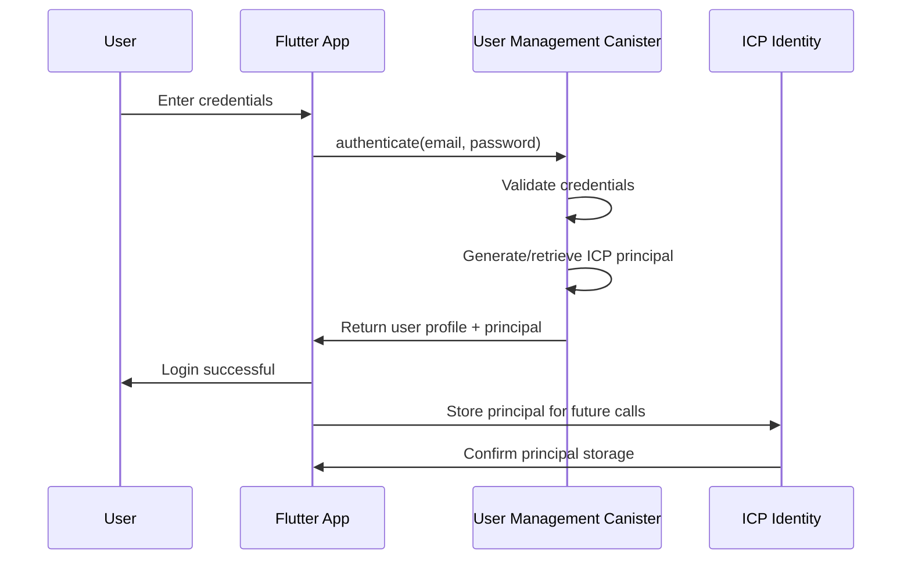

# **Backend Architecture**

## **Canister-Based Service Architecture**

Since we're using ICP canisters as the backend, the architecture is canister-based rather than traditional server-based.

### **Marketplace Canister Implementation**

**Function Organization:**
```
marketplace_canister/
├── src/
│   ├── main.mo                 # Main canister actor
│   ├── types.mo                # Type definitions
│   ├── utils.mo                # Utility functions
│   ├── validation.mo           # Input validation
│   └── search.mo               # Search and filtering
├── test/
│   ├── marketplace_test.mo     # Unit tests
│   └── integration_test.mo     # Integration tests
└── dfx.json                   # DFX configuration
```

**Canister Template:**
```motoko
// Main canister actor
actor Marketplace {
  // Type definitions
  public type Listing = {
    id: Nat;
    seller: Principal;
    title: Text;
    description: Text;
    priceUSD: Nat64;
    cryptoType: Text;
    images: [Text];
    category: Text;
    condition: { #new; #used; #refurbished };
    location: Text;
    shippingOptions: [Text];
    status: { #active; #pending; #sold; #cancelled };
    createdAt: Int;
    updatedAt: Int;
  };
  
  // Storage
  private stable var listings = Map.HashMap<Nat, Listing>();
  private stable var userListings = Map.HashMap<Principal, List<Nat>>();
  private stable var categoryListings = Map.HashMap<Text, List<Nat>>();
  private stable var nextListingId = Nat = 1;
  
  // Security
  private stable var owner = Principal.fromText("2vxsx-fae");
  private stable var paused = false;
  
  // Rate limiting
  private stable var userActions = Map.HashMap<Principal, Int>();
  private stable var lastActionTime = Map.HashMap<Principal, Int>();
  
  // Public functions
  public shared ({ caller }) func createListing(
    title: Text,
    description: Text,
    priceUSD: Nat64,
    cryptoType: Text,
    images: [Text],
    category: Text,
    condition: { #new; #used; #refurbished },
    location: Text,
    shippingOptions: [Text]
  ) : async Result.Result<Nat, Text> {
    // Check if paused
    if (paused) {
      return #err("Marketplace is paused");
    };
    
    // Rate limiting
    if (not _checkRateLimit(caller)) {
      return #err("Rate limit exceeded");
    };
    
    // Input validation
    let validationResult = _validateListingInput(
      title, description, priceUSD, cryptoType, 
      images, category, condition, location, shippingOptions
    );
    
    switch (validationResult) {
      case (#err(msg)) { return #err(msg); };
      case (#ok) { /* Continue */ };
    };
    
    // Create listing
    let listingId = nextListingId;
    nextListingId += 1;
    
    let listing : Listing = {
      id = listingId;
      seller = caller;
      title = title;
      description = description;
      priceUSD = priceUSD;
      cryptoType = cryptoType;
      images = images;
      category = category;
      condition = condition;
      location = location;
      shippingOptions = shippingOptions;
      status = #active;
      createdAt = Time.now();
      updatedAt = Time.now();
    };
    
    // Store listing
    listings.put(listingId, listing);
    
    // Update indexes
    _updateUserListings(caller, listingId);
    _updateCategoryListings(category, listingId);
    
    return #ok(listingId);
  };
  
  // Query functions
  public query func getListing(id: Nat) : async ?Listing {
    return listings.get(id);
  };
  
  public query func getListings(
    query: ?Text,
    category: ?Text,
    minPrice: ?Nat64,
    maxPrice: ?Nat64,
    limit: ?Nat
  ) : async [Listing] {
    var results = List.nil<Listing>();
    
    // Filter logic here...
    
    return List.toArray(results);
  };
  
  // Private helper functions
  private func _checkRateLimit(user: Principal) : Bool {
    // Rate limiting implementation
    return true;
  };
  
  private func _validateListingInput(...) : Result.Result<(), Text> {
    // Input validation implementation
    return #ok;
  };
  
  private func _updateUserListings(user: Principal, listingId: Nat) {
    // Update user listings index
  };
  
  private func _updateCategoryListings(category: Text, listingId: Nat) {
    // Update category listings index
  };
  
  // Emergency functions
  public shared ({ caller }) func pause() : async Bool {
    assert(caller == owner);
    paused := true;
    return true;
  };
  
  public shared ({ caller }) func unpause() : async Bool {
    assert(caller == owner);
    paused := false;
    return true;
  };
};
```

## **Database Architecture**

**On-Chain Schema Design:**
```motoko
// User schema
public type User = {
  id: Principal;
  username: Text;
  email: Text;
  authProvider: Text;
  reputation: Nat;
  createdAt: Int;
  lastLogin: Int;
  isActive: Bool;
  kycVerified: Bool;
  profileImage: ?Text;
};

// Listing schema
public type Listing = {
  id: Nat;
  seller: Principal;
  title: Text;
  description: Text;
  priceUSD: Nat64;
  cryptoType: Text;
  images: [Text];
  category: Text;
  condition: { #new; #used; #refurbished };
  location: Text;
  shippingOptions: [Text];
  status: { #active; #pending; #sold; #cancelled };
  createdAt: Int;
  updatedAt: Int;
};

// Atomic swap schema
public type AtomicSwap = {
  id: Nat;
  listingId: Nat;
  buyer: Principal;
  seller: Principal;
  secretHash: [Nat8];
  secret: ?[Nat8];
  amount: Nat64;
  cryptoType: Text;
  timeout: Int;
  status: { #pending; #completed; #cancelled; #disputed };
  createdAt: Int;
  completedAt: ?Int;
};
```

**Data Access Layer (Repository Pattern):**
```motoko
// User repository
module UserRepository {
  public func createUser(user: User) : Result.Result<(), Text> {
    // Implementation
  };
  
  public func getUser(id: Principal) : ?User {
    // Implementation
  };
  
  public func updateUser(id: Principal, updates: UserUpdate) : Result.Result<(), Text> {
    // Implementation
  };
  
  public func deleteUser(id: Principal) : Result.Result<(), Text> {
    // Implementation
  };
  
  public func getUsersByCriteria(criteria: UserCriteria) : [User] {
    // Implementation
  };
};

// Listing repository
module ListingRepository {
  public func createListing(listing: Listing) : Result.Result<Nat, Text> {
    // Implementation
  };
  
  public func getListing(id: Nat) : ?Listing {
    // Implementation
  };
  
  public func updateListing(id: Nat, updates: ListingUpdate) : Result.Result<(), Text> {
    // Implementation
  };
  
  public func deleteListing(id: Nat) : Result.Result<(), Text> {
    // Implementation
  };
  
  public func searchListings(query: SearchQuery) : [Listing] {
    // Implementation
  };
};
```

## **Authentication Architecture**

**Auth Flow Diagram:**


**Authentication Middleware:**
```motoko
// Authentication guard
public func authenticate(caller: Principal) : ?User {
  let user = users.get(caller);
  return user;
};

public func requireAuthentication(caller: Principal) : User {
  switch (authenticate(caller)) {
    case (?user) { return user; };
    case (null) { throw #err("Authentication required"); };
  };
};

public func requireRole(caller: Principal, requiredRole: Text) : User {
  let user = requireAuthentication(caller);
  if (not _hasRole(user, requiredRole)) {
    throw #err("Insufficient permissions");
  };
  return user;
};
```
