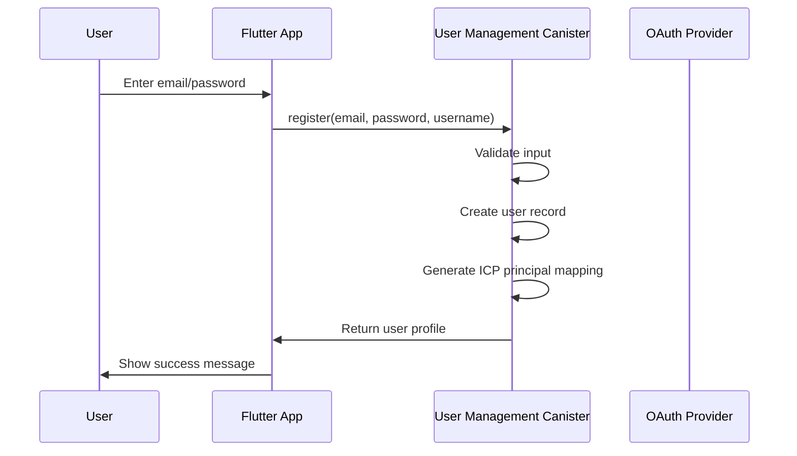
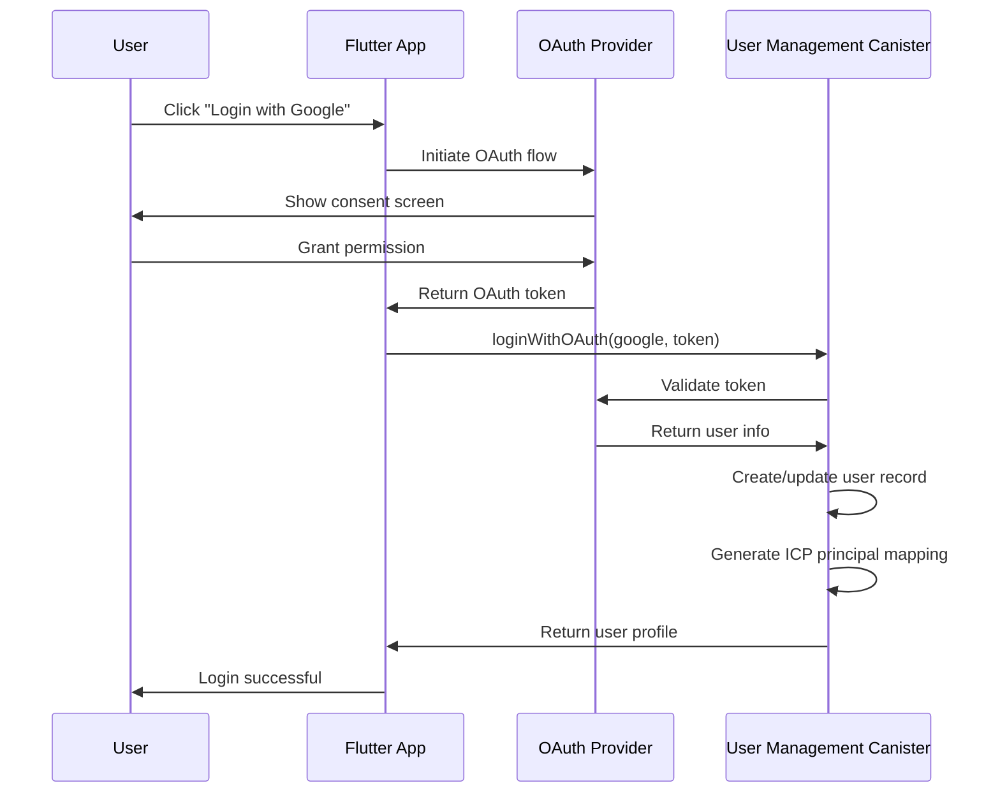
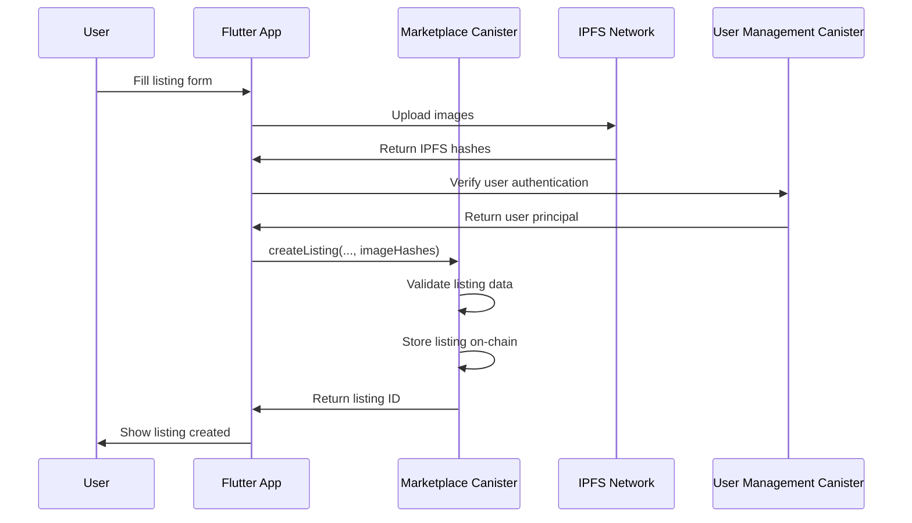
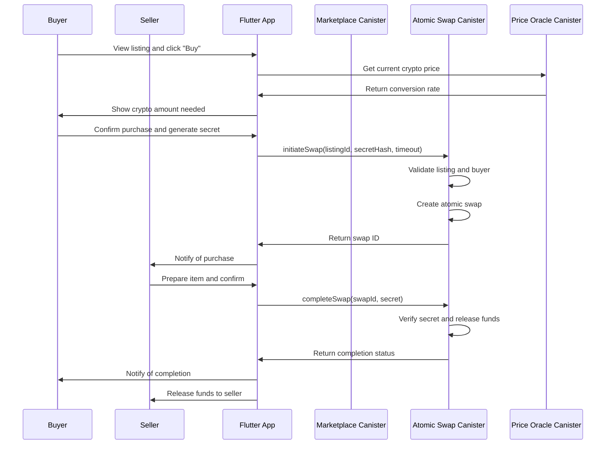
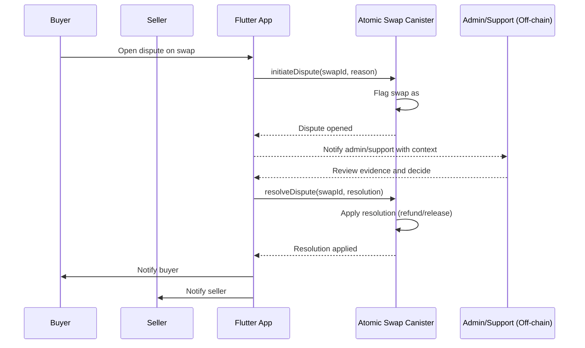

# **Core Workflows**

## **User Registration Flow**



## **OAuth Login Flow**



## **Create Listing Flow**



## **Atomic Swap Flow**



## **Dispute Resolution Flow (MVP)**



## **GitHub Actions Orchestration**

### Overview table

| Workflow | Purpose | Triggers | Key gates | Outputs / side-effects |
|---|---|---|---|---|
| `workflow-lint.yml` (Workflow Lint) | Lint all workflows (actionlint + yamllint) and validate github-script usage | pull_request to `main`,`develop`; push to any branch | n/a | Check-run `lint` used as required status check |
| `pr-lint.yml` (PR Lint) | Enforce branch naming, story id in PR, and existence of story file | pull_request [opened/edited/synchronize/reopened]; push to `story/*`,`feature/*`,`fix/*`,`chore/*`,`patch/*` | For `story/*`: branch must match `story/<id>-<slug>` and PR title/body must contain a story id; story file `docs/stories/<id>.*.md` must exist | Fails fast on violations; reminder notice to keep Status updated |
| `flutter-ci.yml` (Flutter CI) | Build, analyze, format-check, and test Flutter app | pull_request to `main`,`develop`; push to `story/*` | n/a | Check-run `build-and-test` |
| `auto-pr-from-qa.yml` (Auto PR and Auto-merge on QA Done) | On pushes to `story/*`, lint workflows, parse preflight, and invoke reusable auto‑PR | push to `story/*`; workflow_dispatch | Delegates gating to reusable job (requires story `Status: Done`) | Invokes reusable to create/reuse PR, apply labels, optionally enable auto‑merge/approve |
| `reusable-auto-pr.yml` (Reusable – Auto PR and Auto-merge) | Ensure PR exists, apply labels, optionally enable native auto‑merge and auto‑approve | workflow_call only | For `story/*`: requires `docs/stories/<id>.*.md` with `Status: Done`; otherwise exits; for `feature|fix|chore|patch/*`: allowed without Done | Labels `automerge-candidate`, `automerge-ok`, `qa:approved`; outputs PR number; optionally enables native auto‑merge (GraphQL) and bot approval |
| `merge-on-green-fallback.yml` (Merge on Green – Fallback) | Merge PRs when checks are green if native auto‑merge is not already enabled | workflow_run of `Flutter CI`, `PR Lint`, `Workflow Lint` (completed); pull_request [labeled/synchronize/reopened/ready_for_review]; workflow_dispatch | Requires label `automerge-ok` or `qa:approved`; attempts `update-branch` if behind; waits for required checks to succeed | If repo/PR native auto‑merge is disabled, merges via REST (squash) and deletes source branch; if behind and cannot update, applies `needs-rebase` and comments |
| `auto-rebase.yml` (Auto Rebase Story PRs) | Keep `story/*` PR branches rebased onto `develop` | push to `develop`; schedule every 30 min | n/a | Force‑pushes rebased `story/*` heads; logs conflicts as warnings |
| `qa-gate-producer.yml` (QA Gate) | Emit notice if QA labels missing | pull_request [opened/synchronize/reopened/labeled/unlabeled/ready_for_review] | Looks for `qa:approved` or `automerge-ok` | Notice in logs (non-blocking) |
| `qa-auto-merge.yml` (QA Auto Merge) | Enable native auto‑merge when `qa-approved` label present | pull_request [labeled/unlabeled/edited/synchronize] | Base `develop` and head in allowed prefixes; requires `qa-approved` | Enables GitHub Auto‑merge (squash) via action |
| `labeler.yml` (PR Labeler) | Auto‑apply labels from `.github/labeler.yml` | pull_request_target [opened/synchronize/reopened] | n/a | Labels applied per config |
| `enforce-required-checks.yml` (Enforce Required Checks) | Ensure branch protection requires status checks | workflow_dispatch; push to select workflow files; weekly schedule | Requires `REPO_ADMIN_TOKEN` to write branch protection | Requires contexts: `build-and-test`, `pr-lint`, `lint` on `main` and `develop` |
| `enable-auto-merge.yml` (Enable Auto‑merge) | One‑time repo setting to allow native auto‑merge | workflow_dispatch (with confirm) | Skips when `CI_LOCAL=true` | Enables repo `allow_auto_merge=true` via REST |
| `ci-to-story-bridge.yml` (CI → Story Bridge) | Note successful automation run in the story file | workflow_run of `Auto PR and Auto-merge on QA Done` (success) | Story branch with matching `docs/stories/<id>.*.md` | Appends a non‑committal note to story Change Log (does not change Status) |
| `auto-pr-self-test.yml` (Auto PR Self‑test) | Manual matrix test of preflight parser | workflow_dispatch | n/a | Demonstrates behavior; not in normal chain |
| `ci-auto-pr.yml` (Legacy CI and Auto PR) | Deprecated placeholder | workflow_dispatch | n/a | No‑op, guidance only |

### End‑to‑end sequence

```mermaid
sequenceDiagram
    participant Dev as Developer
    participant GH as GitHub (Repo)
    participant PRL as PR Lint
    participant WF as Workflow Lint
    participant CI as Flutter CI
    participant AP as Auto PR (auto-pr-from-qa)
    participant RU as Reusable Auto PR
    participant QA as QA Gate / Labels
    participant MOG as Merge on Green (fallback)
    participant RB as Auto Rebase

    Dev->>GH: push story/<id>-<slug>
    GH-->>PRL: trigger (push)
    GH-->>WF: trigger (push)
    GH-->>CI: trigger (push)
    GH-->>AP: trigger (push)
    AP->>RU: call reusable
    RU->>RU: Check story file Status == Done?
    alt Status not Done
      RU-->>AP: Exit (no PR changes)
    else Status Done
      RU->>GH: Create or reuse PR → base develop
      RU->>GH: Label PR: automerge-candidate, automerge-ok, qa:approved
      RU->>GH: Optionally enable native Auto‑merge
    end
    GH-->>PRL: trigger (pull_request)
    GH-->>WF: trigger (pull_request)
    GH-->>CI: trigger (pull_request)
    QA->>GH: (optional) add qa-approved label
    par Background
      RB->>GH: Scheduled/On develop push: rebase story PRs onto develop
    end
    GH-->>MOG: trigger (workflow_run/PR labeled)
    MOG->>GH: If PR behind, attempt update-branch
    alt Cannot update
      MOG->>GH: Label needs-rebase and comment; skip merge
    else Up-to-date
      MOG->>GH: Wait for required checks: build-and-test, pr-lint, lint
      alt Native auto‑merge enabled
        GH-->>GH: GitHub merges on green (native)
      else Not enabled
        MOG->>GH: Merge via REST (squash) and delete branch
      end
    end
```

### Operations notes (local mirroring)

- Run full local validation (installs linters if needed, runs Flutter gates, mirrors selected workflows via `act`):
  - `scripts/dev-validate.sh`
- Quick targeted workflow simulations with `act`:
  - `scripts/run-act.sh qa` → push to story branch → `auto-pr-from-qa.yml`
  - `scripts/run-act.sh mog` → PR labeled → `merge-on-green-fallback.yml`
- Local runs set `CI_LOCAL=true` so remote‑only calls (e.g., enabling repo auto‑merge, merging PRs) are skipped while the rest of the logic executes.

### Risks and edge cases

- Missing labels: Without `automerge-ok` or `qa:approved`, fallback merge is skipped for story PRs.
- Branch behind base: Fallback attempts `update-branch`; on failure, applies `needs-rebase` and comments instructions.
- Required checks not green: Fallback waits with retries; times out without merging.
- Repo auto‑merge disabled: Reusable step will not enable native Auto‑merge; fallback may still merge via REST if gates are satisfied.
- Missing story file / Status not Done: Reusable auto‑PR exits for `story/*` branches; no PR is created/labeled.
- Permissions: Creating PRs or labels may return HTTP 403 under restricted tokens; steps exit gracefully.
- Admin token not configured: `enforce-required-checks.yml` emits guidance and skips enforcement until `REPO_ADMIN_TOKEN` is set.
