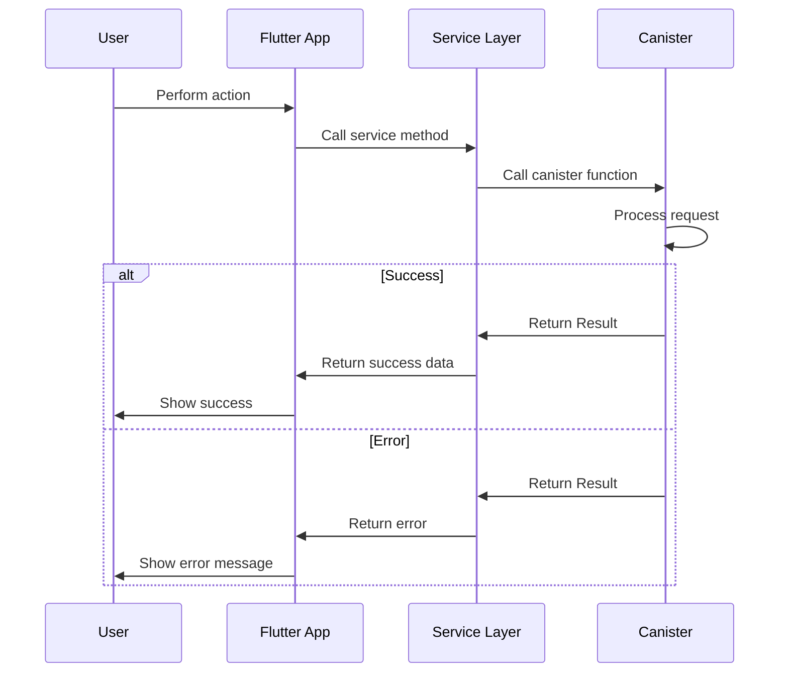

# **Error Handling Strategy**

## **Error Flow**



## **Error Response Format**

**Canister Error Response:**
```motoko
public type Error = {
  code: Text;
  message: Text;
  details: ?[(Text, Value)];
  timestamp: Int;
};

public type Result<T, E> = {
  #ok: T;
  #err: E;
};
```

**Frontend Error Handler:**
```dart
class ErrorHandler {
  static void handleCanisterError(Result error, BuildContext context) {
    String message;
    
    switch (error.code) {
      case 'AUTH_REQUIRED':
        message = 'Please log in to continue';
        Navigator.pushNamed(context, '/login');
        break;
      case 'INSUFFICIENT_BALANCE':
        message = 'Insufficient balance for this transaction';
        break;
      case 'RATE_LIMIT_EXCEEDED':
        message = 'Too many requests. Please try again later';
        break;
      default:
        message = error.message ?? 'An error occurred';
    }
    
    ScaffoldMessenger.of(context).showSnackBar(
      SnackBar(content: Text(message)),
    );
  }
}
```

## **Frontend Error Handling**

```dart
class MarketplaceService {
  Future<Listing> createListing(CreateListingRequest request) async {
    try {
      final result = await _icpService.marketplaceActor.createListing(
        request.title,
        request.description,
        request.priceUSD,
        // ... other parameters
      );
      
      switch (result) {
        case (:ok listing):
          return _mapListingFromResponse(listing);
        case (:err error):
          throw MarketplaceException.fromCanisterError(error);
      }
    } on NetworkException catch (e) {
      throw MarketplaceException.networkError();
    } catch (e) {
      throw MarketplaceException.unknownError();
    }
  }
}
```

## **Backend Error Handling**

```motoko
public shared ({ caller }) func createListing(
  title: Text,
  description: Text,
  priceUSD: Nat64,
  // ... other parameters
) : async Result.Result<Nat, Error> {
  // Check authentication
  let user = authenticate(caller);
  switch (user) {
    case (null) { return #err({ code = "AUTH_REQUIRED"; message = "Authentication required"; details = null; timestamp = Time.now() }); };
    case (?user) { /* Continue */ };
  };
  
  // Check rate limiting
  if (not _checkRateLimit(caller)) {
    return #err({ code = "RATE_LIMIT_EXCEEDED"; message = "Rate limit exceeded"; details = null; timestamp = Time.now() });
  };
  
  // Validate input
  let validationResult = _validateListingInput(title, description, priceUSD);
  switch (validationResult) {
    case (#err(msg)) { return #err({ code = "INVALID_INPUT"; message = msg; details = null; timestamp = Time.now() }); };
    case (#ok) { /* Continue */ };
  };
  
  // Create listing
  let listingId = nextListingId;
  nextListingId += 1;
  
  // Store listing
  // ... storage logic
  
  return #ok(listingId);
};
```
