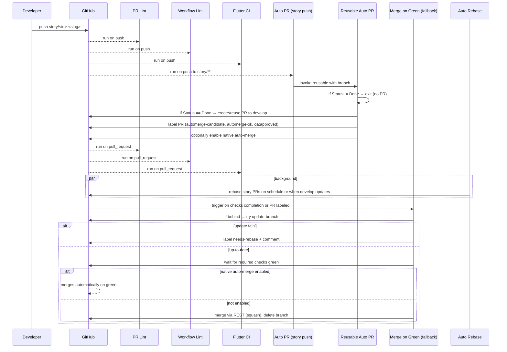

# GitHub Actions Orchestration (Deep Dive)

## What this covers
- Complete view of our automation: local mirroring, CI checks, PR creation, QA gating, and merge-to-develop
- Plain-English purpose and order of execution for each workflow
- When and how merges happen; how rebase/update-branch works
- How to run the same flows locally with `act`

## Big picture
- Push to a story branch (`story/<id>-<slug>`) kicks off lint and CI.
- For `story/*` branches, a PR to `develop` is created/reused automatically only when the story file contains `Status: Done`. Non‑story prefixes may always create a PR.
- A merge orchestrator waits for required checks; if native auto‑merge isn’t already enabled, it merges via REST and deletes the source branch. If the branch is behind and can’t be auto‑updated, it labels `needs-rebase` and comments instructions.
- A scheduled job periodically rebases open story PRs onto `develop`.
- Branch protection enforces the required checks on `main` and `develop`.

## End‑to‑end flow (order of execution)
1. Developer pushes to `story/<id>-<slug>`
   - `workflow-lint.yml` validates all workflows.
   - `pr-lint.yml` checks branch naming on push.
   - `flutter-ci.yml` runs analyze/format/test.
   - `auto-pr-from-qa.yml` runs; it lints workflows, does preflight parse, then calls the reusable auto‑PR job. For `story/*`, PR ensure step runs only if the story file is `Status: Done`.

2. Reusable Auto PR (`reusable-auto-pr.yml`)
   - Ensures a PR exists for supported branches.
   - Auto‑labeling and auto‑merge enabling remain gated; story `Status: Done` is not required to create the PR and is expected only after merge.
   - For `feature|fix|chore|patch/*`: allowed by this job, but note the top-level entry workflow triggers on pushes to `story/**`.

3. Pull request phase (PR targets `develop`)
   - `pr-lint.yml` (on PR): validates story branch naming, checks `story <id>` in title/body, ensures story file exists.
   - `flutter-ci.yml` (on PR): analyze/format/test.
   - `workflow-lint.yml` (on PR): actionlint + yamllint + github-script validation.

4. Merge orchestration
   - `merge-on-green-fallback.yml` triggers via:
     - `workflow_run` for Flutter CI, PR Lint, Workflow Lint completion, and
     - `pull_request` (labeled/synchronize/reopened/ready_for_review).
   - Finds the PR for the branch and checks for `automerge-ok` or `qa:approved`.
   - If PR is behind base, tries GitHub’s Update Branch API:
     - If update fails, applies `needs-rebase` and comments instructions.
   - Waits for required checks to be green (dynamic inspection of check‑runs).
   - If native Auto‑merge is already enabled, GitHub merges on green; otherwise it merges via REST (squash) and deletes the source branch. Local runs with `CI_LOCAL=true` skip the actual merge.

5. Background rebase
   - `auto-rebase.yml` runs on schedule and on pushes to `develop`.
   - Rebases open `story/*` PR branches onto `origin/develop`; logs conflicts as warnings.

6. Required checks enforcement
   - `enforce-required-checks.yml` ensures branch protection on `main` and `develop` requires:
     - `build-and-test` (Flutter CI),
     - `pr-lint` (PR Lint),
     - `lint` (Workflow Lint).
   - Requires a one‑time repo admin token `REPO_ADMIN_TOKEN` to write branch protection.

## Workflow catalog
| Workflow file | Purpose | Triggers | Key gates | Outputs / side‑effects |
|---|---|---|---|---|
| `workflow-lint.yml` (Workflow Lint) | Lint workflows (actionlint + yamllint) and enforce unified style (no `actions/github-script`) | `pull_request` to `main`,`develop`; `push` to any | Bans `actions/github-script`; checks for `exec` conflicts if reintroduced | Check‑run `lint` (required) |
| `pr-lint.yml` (PR Lint) | Enforce story branch regex and story reference in PR; ensure story file exists | `pull_request` (opened/edited/synchronize/reopened), `push` to `story/*` and typical prefixes | For `story/*`: `^story/[0-9]+(\.[0-9]+)*-[a-z0-9-]+$`, PR text must contain `story <id>`, story file must exist | Fails/notes; reminder to keep Status updated |
| `flutter-ci.yml` (Flutter CI) | Analyze, format check, and test the Flutter app | `pull_request` to `main`,`develop`; `push` to `story/*`; `workflow_dispatch` | n/a | Check‑run `build-and-test` (required) |
| `auto-pr-from-qa.yml` | On `story/**` pushes, lint + preflight parse, then call the reusable auto‑PR | `push` to `story/**`; `workflow_dispatch` | Delegates story `Status: Done` gate to reusable | Invokes reusable job; orchestrates open‑PR path |
| `reusable-auto-pr.yml` | Ensure PR exists, label for merge, optionally enable native auto‑merge and auto‑approve | `workflow_call` only | `story/*` requires `docs/stories/<id>.*.md` with `Status: Done`; non‑story prefixes allowed | Labels `automerge-candidate`,`automerge-ok`,`qa:approved`; optionally enable native Auto‑merge; bot approval (opt‑in) |
| `merge-on-green-fallback.yml` | Merge PRs when checks are green if native auto‑merge is not already enabled | `workflow_run` (Flutter CI, PR Lint, Workflow Lint); `pull_request` (labeled/sync/reopened/ready_for_review); `workflow_dispatch` | Needs `automerge-ok` or `qa:approved`; tries Update Branch; waits for checks | If not native auto‑merge, merges via REST on green; deletes source; on failure to update, labels `needs-rebase` and comments |
| `auto-rebase.yml` | Periodically rebase open story PRs onto `develop` | `push` to `develop`; cron schedule | n/a | Rebase + force‑with‑lease; logs conflicts |
| `qa-gate-producer.yml` | Informational QA gate check for labels | `pull_request` (opened/sync/reopened/labeled/unlabeled/ready_for_review) | Looks for `qa:approved` or `automerge-ok` | Notice in logs (non‑blocking) |
| `qa-auto-merge.yml` | Enable native GitHub Auto‑merge when `qa-approved` is present | `pull_request` (labeled/unlabeled/edited/synchronize) | Base `develop`, head in allowed prefixes; label `qa-approved` | Native Auto‑merge turned on for PR |
| `labeler.yml` | Auto‑apply labels from `.github/labeler.yml` | `pull_request_target` (opened/sync/reopened) | n/a | PR labels applied |
| `enforce-required-checks.yml` | Enforce branch protection required contexts | `workflow_dispatch`; weekly cron; pushes to selected workflow files | Needs `REPO_ADMIN_TOKEN` | Requires `build-and-test`, `pr-lint`, `lint` on `main`,`develop` |
| `enable-auto-merge.yml` | One‑time repo setting to allow native auto‑merge | `workflow_dispatch` with confirm | Skips when `CI_LOCAL=true` | Sets `allow_auto_merge=true` on repo |
| `ci-to-story-bridge.yml` | Note successful automation run in story file | `workflow_run` (Auto PR workflow successful) | Story branch with matching story file | Appends non‑committal note to story Change Log |
| `auto-pr-self-test.yml` | Manual matrix self‑test of preflight parser | `workflow_dispatch` | n/a | Demonstration only |
| `ci-auto-pr.yml` | Legacy placeholder (disabled) | `workflow_dispatch` | n/a | No‑op |

## QA and labels — how they drive merging
- For story branches: automation only creates/labels PRs when the story file’s `Status: Done` is present.
- Labels `automerge-ok` or `qa:approved` are required for the merge fallback path; the reusable job applies both for stories marked Done.
- `qa-auto-merge.yml` enables native auto‑merge when `qa-approved` appears on a PR to `develop` with allowed head prefixes.

## Feature flags and environment
- Repository variables (feature flags) used by auto‑PR path:
  - `AUTO_PR_ENABLED` (default true)
  - `AUTO_MERGE_ENABLED` (default true)
  - `AUTO_APPROVE_ENABLED` (default true)
- Local runs set `CI_LOCAL=true` so remote‑only effects (enabling repo settings, merging PRs) are skipped while logic still executes.

## Local mirroring (how to run locally)
- Full local validation and partial workflow simulation:
  - `scripts/dev-validate.sh`
    - Installs/uses actionlint & yamllint
    - Runs ShellCheck on repo scripts (non‑blocking)
    - Runs Flutter format/analyze/test
    - Executes selected workflows with `act` and `CI_LOCAL=true`
    - Enforces unified workflow style: Bash/composite actions only (no `actions/github-script`)
- Targeted `act` runs:
  - `scripts/run-act.sh qa` → simulate push to story branch → `auto-pr-from-qa.yml`
  - `scripts/run-act.sh mog` → simulate PR labeled → `merge-on-green-fallback.yml`
- Developer helper:
  - `scripts/story-flow.sh watch-rebase` to keep your branch rebased onto `origin/develop`
  - `scripts/story-flow.sh open-pr` to create a PR and request native auto‑merge via `gh`

## Risks and edge cases
- Missing labels: Without `automerge-ok` or `qa:approved`, fallback merge is skipped.
- Branch behind base: Fallback tries Update Branch; on failure, labels `needs-rebase` and comments instructions.
- Required checks not green: Fallback waits with retries; times out gracefully without merging.
- Repo native Auto‑merge disabled: Reusable won’t enable it; fallback still merges on green when gates are met.
- Missing story file or `Status` not Done: Reusable exits; no PR created/labeled.
- Permission limits (403): API steps exit gracefully; summaries explain why.
- Admin token missing: Required‑checks enforcement prints guidance; no changes made.

## Sequence diagram (end‑to‑end)

## One‑command local validation
- Run: `scripts/dev-validate.sh`
  - Expect: workflow lint passes, Flutter checks pass; `act` simulates selected workflows with `CI_LOCAL=true` so merge/settings calls are no‑ops.
