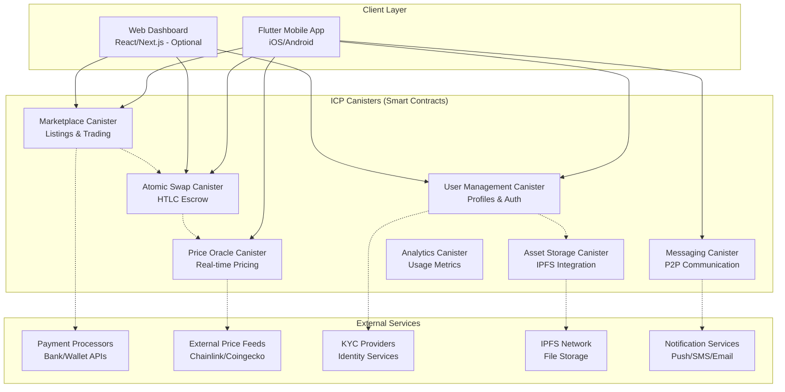

# **High Level Architecture**

## **Technical Summary**

This architecture implements an **ICP-first approach** where Flutter mobile apps communicate directly with Internet Computer canisters, eliminating the traditional backend. All business logic, data persistence, authentication, and API endpoints run as smart contracts on ICP. We use a hybrid authentication model implemented inside canisters (email/password + social OAuth + ICP principal mapping), with optional wallet connect later. Progressive decentralization follows the PRD’s stage gates.

## **Platform and Infrastructure Choice**

**Platform:** Internet Computer (Primary) + Optional CDN for static assets
**Key Services:** ICP Canisters (Smart Contracts), Cycles Management, Boundary Nodes, CDN (optional)
**Deployment Host and Regions:** ICP Mainnet + Geo-distributed canisters

**Rationale:**
- **ICP-first decentralization** with canister-native services
- **No traditional backend** to maintain or secure
- **Hybrid Auth in-canister** (email/password + OAuth + ICP mapping) with optional wallet connect later
- **Scalability** through ICP's horizontal scaling
- **Performance** with sub-second finality and high throughput
- **Progressive complexity**: add features/cross-chain per PRD stage gates; fallback to auxiliary services only if needed

## **Repository Structure**

**Structure:** Monorepo with Flutter app + ICP canisters
**Monorepo Tool:** Nx workspace + DFX (ICP SDK)
**Package Organization:** Flutter mobile app + ICP canisters + shared types

## **Architecture Diagram - ICP Native**

## **Architectural Patterns**

- **Canister-Based Architecture:** Each logical component as separate canister - _Rationale:_ Enables independent scaling and deployment of different concerns
- **Direct Client-to-Canister Communication:** Flutter apps call canisters directly - _Rationale:_ Eliminates backend layer, reduces latency
- **Hybrid Authentication in Canister:** Traditional + OAuth + ICP principal mapping - _Rationale:_ Lower onboarding friction while keeping on-chain authorization
- **On-Chain Data Storage:** Canister state for business data; IPFS for large assets - _Rationale:_ Decentralization and cost efficiency
- **Inter-Canister Communication:** Canisters communicate directly - _Rationale:_ Efficient intra-system communication
- **Cycles-Based Economics:** Pay-per-use model - _Rationale:_ Cost-efficient, scales with usage
- **Asset Offloading to IPFS:** Large files stored on IPFS - _Rationale:_ Cost-effective for large media/files

## **MVP Scope Alignment**

Refer to the PRD’s ICP-first MVP constraints, KPIs, and stage gates:
- [0. MVP Scope (ICP-First)](../prd/0-mvp-scope.md)
- Stage gates and KPIs are mirrored in the timeline and success metrics sections of the PRD.
