# Workflow Orchestration Optimization - Technical Execution Plan

**Story**: 0.10 - Workflow Orchestration Optimization and Cost Reduction  
**Status**: Ready for Implementation  
**Created**: 2025-08-27  
**Priority**: High (Cost Impact)

## Executive Summary

This document provides detailed technical specifications for implementing intelligent workflow orchestration to reduce GitHub Actions costs by 70-80% while improving developer experience.

### Current State Problems
- **3+ workflows** trigger simultaneously on every `story/**` push
- **75+ minutes** of runner time per push (often unnecessary)
- **60-70% waste** from running Flutter CI on documentation changes
- **Redundant execution** on push + PR creation
- **No early failure termination** - expensive operations run even after lint failures

### Target State Goals
- **Intelligent routing** based on file changes
- **Sequential execution** with early termination
- **10 minutes average** execution time for relevant changes
- **0 workflows** for documentation-only changes
- **70-80% cost reduction** in GitHub Actions minutes

## Technical Architecture

### Current Workflow Triggers (BEFORE)


### Optimized Workflow Orchestration (AFTER)

```mermaid
graph TD
    A[Push to story/**] --> B[Story Orchestrator]
    B --> C{Analyze Changes}
    
    C -->|Docs Only| D[Skip All Workflows]
    C -->|Workflows Only| E[Workflow Lint → Done]
    C -->|Flutter Changes| F[Sequential Chain]
    
    F --> G[Workflow Lint: 2min]
    G --> H[Preflight Parse: 1min]
    H --> I[Flutter CI: 7min]
    I --> J[Create PR: 2min]
    
    J --> K[Total: 12min sequential]
    D --> L[Total: 0min]
    E --> M[Total: 2min]
```


## Implementation Phases

### Phase 1: Path-Based Filtering (Immediate - 50-60% savings)

#### 1.1 Update Flutter CI with Path Filtering
**File**: `.github/workflows/flutter-ci.yml`

**Changes**:
```yaml
on:
  pull_request:
    branches: [ "main", "develop" ]
    paths:
      - 'crypto_market/**/*.dart'
      - 'crypto_market/pubspec.yaml'
      - 'crypto_market/pubspec.lock'
      - 'crypto_market/analysis_options.yaml'
      - 'crypto_market/lib/**'
      - 'crypto_market/test/**'
  push:
    branches:
      - 'story/**'
    paths:
      - 'crypto_market/**/*.dart'
      - 'crypto_market/pubspec.yaml'
      - 'crypto_market/pubspec.lock'
      - 'crypto_market/analysis_options.yaml'
      - 'crypto_market/lib/**'
      - 'crypto_market/test/**'
  workflow_dispatch:
```

**Impact**: Flutter CI will skip when only docs/workflows change

#### 1.2 Remove Redundant Push Triggers
**File**: `.github/workflows/pr-lint.yml`

**Change**: Remove the push trigger for story branches since `auto-pr-from-qa.yml` handles this:
```yaml
# REMOVE THESE LINES:
# push:
#   branches:
#     - 'story/**'
#     - 'feature/**'
#     - 'fix/**'
#     - 'chore/**'
#     - 'patch/**'
```

**Impact**: Eliminates duplicate PR lint execution

#### 1.3 Add Conditional Execution to Auto-PR Workflow
**File**: `.github/workflows/auto-pr-from-qa.yml`

**Add after preflight-parse job**:
```yaml
  flutter-ci-conditional:
    needs: [workflow-lint, preflight-parse]
    if: ${{ vars.AUTO_PR_ENABLED != 'false' && contains(github.event.commits[0].modified, '.dart') }}
    uses: ./.github/workflows/flutter-ci.yml
    secrets: inherit
```

**Impact**: Flutter CI only runs when Dart files are modified

### Phase 2: Master Orchestrator (70-80% savings)

#### 2.1 Create Story Orchestrator Workflow
**File**: `.github/workflows/story-orchestrator.yml`

```yaml
name: Story Branch Orchestrator

on:
  push:
    branches:
      - 'story/**'
  workflow_dispatch:
    inputs:
      branch:
        description: "Target branch to operate on"
        required: false
        type: string

permissions:
  contents: write
  pull-requests: write
  issues: write
  actions: read
  checks: read
  statuses: read

concurrency:
  group: story-${{ github.ref }}-${{ github.sha }}
  cancel-in-progress: true

jobs:
  analyze-changes:
    name: Analyze File Changes
    runs-on: ubuntu-latest
    timeout-minutes: 5
    outputs:
      run-flutter: ${{ steps.changes.outputs.flutter }}
      run-workflows: ${{ steps.changes.outputs.workflows }}
      run-docs: ${{ steps.changes.outputs.docs }}
      run-config: ${{ steps.changes.outputs.config }}
      changes-summary: ${{ steps.summary.outputs.summary }}
    steps:
      - name: Checkout
        uses: actions/checkout@v4
        with:
          fetch-depth: 0
          
      - name: Detect file changes
        uses: dorny/paths-filter@v2
        id: changes
        with:
          filters: |
            flutter:
              - 'crypto_market/**/*.dart'
              - 'crypto_market/pubspec.yaml'
              - 'crypto_market/pubspec.lock'
              - 'crypto_market/analysis_options.yaml'
              - 'crypto_market/lib/**'
              - 'crypto_market/test/**'
            workflows:
              - '.github/workflows/**'
              - '.github/actions/**'
            docs:
              - 'docs/**'
              - '*.md'
              - 'crypto_market/README.md'
            config:
              - 'crypto_market/l10n.yaml'
              - 'crypto_market/dfx.json'
              - 'crypto_market/devtools_options.yaml'
              
      - name: Create execution summary
        id: summary
        run: |
          echo "## Workflow Execution Plan" >> $GITHUB_STEP_SUMMARY
          echo "| Category | Will Execute | Reason |" >> $GITHUB_STEP_SUMMARY
          echo "|----------|--------------|---------|" >> $GITHUB_STEP_SUMMARY
          echo "| Flutter CI | ${{ steps.changes.outputs.flutter }} | Dart/Flutter files changed |" >> $GITHUB_STEP_SUMMARY
          echo "| Workflow Lint | ${{ steps.changes.outputs.workflows }} | GitHub workflow files changed |" >> $GITHUB_STEP_SUMMARY
          echo "| Documentation | ${{ steps.changes.outputs.docs }} | Documentation files changed |" >> $GITHUB_STEP_SUMMARY
          echo "| Configuration | ${{ steps.changes.outputs.config }} | Configuration files changed |" >> $GITHUB_STEP_SUMMARY
          
          summary="Flutter:${{ steps.changes.outputs.flutter }},Workflows:${{ steps.changes.outputs.workflows }},Docs:${{ steps.changes.outputs.docs }}"
          echo "summary=$summary" >> $GITHUB_OUTPUT

  # Sequential execution chain
  workflow-lint:
    name: Workflow Lint
    needs: analyze-changes
    if: needs.analyze-changes.outputs.run-workflows == 'true'
    runs-on: ubuntu-latest
    timeout-minutes: 10
    steps:
      - name: Checkout
        uses: actions/checkout@v4
        with:
          fetch-depth: 0
      - name: Common setup
        uses: ./.github/actions/common-setup
      - name: Install actionlint (pinned)
        run: |
          set -euo pipefail
          VERSION="1.7.1"
          mkdir -p "$HOME/bin"
          curl -sSfL https://raw.githubusercontent.com/rhysd/actionlint/main/scripts/download-actionlint.bash | bash -s -- "${VERSION}" "$HOME/bin"
          echo "$HOME/bin" >> "$GITHUB_PATH"
      - name: Run actionlint (YAML only)
        run: |
          set -euo pipefail
          actionlint -shellcheck=
      - name: Install yamllint (pinned)
        run: |
          set -euo pipefail
          python3 -m pip install --user yamllint==1.35.1
      - name: Run yamllint on workflows
        run: |
          set -euo pipefail
          ~/.local/bin/yamllint --strict .github/workflows

  preflight-parse:
    name: Preflight Parser
    needs: [analyze-changes, workflow-lint]
    if: |
      always() &&
      (needs.workflow-lint.result == 'success' || needs.workflow-lint.result == 'skipped')
    runs-on: ubuntu-latest
    steps:
      - name: Checkout
        uses: actions/checkout@v4
        with:
          fetch-depth: 0
      - name: Run preflight parser
        shell: bash
        run: |
          set -euo pipefail
          bash scripts/preflight-parse.sh "${{ github.ref_name }}"

  flutter-ci:
    name: Flutter CI
    needs: [analyze-changes, preflight-parse]
    if: |
      always() &&
      needs.analyze-changes.outputs.run-flutter == 'true' &&
      needs.preflight-parse.result == 'success'
    uses: ./.github/workflows/flutter-ci.yml
    secrets: inherit

  create-pr-and-automerge:
    name: Create PR and Auto-merge
    needs: [analyze-changes, flutter-ci, preflight-parse]
    if: |
      always() &&
      vars.AUTO_PR_ENABLED != 'false' &&
      (needs.flutter-ci.result == 'success' || needs.flutter-ci.result == 'skipped') &&
      needs.preflight-parse.result == 'success'
    uses: ./.github/workflows/reusable-auto-pr.yml
    with:
      branch: ${{ github.ref_name }}
      enable_auto_merge: ${{ vars.AUTO_MERGE_ENABLED != 'false' }}
      auto_approve: ${{ vars.AUTO_APPROVE_ENABLED == 'true' }}
      dry_run: false
    secrets: inherit

  execution-summary:
    name: Execution Summary
    needs: [analyze-changes, workflow-lint, preflight-parse, flutter-ci, create-pr-and-automerge]
    if: always()
    runs-on: ubuntu-latest
    steps:
      - name: Generate execution report
        run: |
          echo "## Workflow Execution Results" >> $GITHUB_STEP_SUMMARY
          echo "**Changes Detected**: ${{ needs.analyze-changes.outputs.changes-summary }}" >> $GITHUB_STEP_SUMMARY
          echo "" >> $GITHUB_STEP_SUMMARY
          echo "| Job | Status | Duration |" >> $GITHUB_STEP_SUMMARY
          echo "|-----|--------|----------|" >> $GITHUB_STEP_SUMMARY
          echo "| Workflow Lint | ${{ needs.workflow-lint.result || 'skipped' }} | - |" >> $GITHUB_STEP_SUMMARY
          echo "| Preflight Parse | ${{ needs.preflight-parse.result || 'skipped' }} | - |" >> $GITHUB_STEP_SUMMARY
          echo "| Flutter CI | ${{ needs.flutter-ci.result || 'skipped' }} | - |" >> $GITHUB_STEP_SUMMARY
          echo "| Create PR | ${{ needs.create-pr-and-automerge.result || 'skipped' }} | - |" >> $GITHUB_STEP_SUMMARY
```

#### 2.2 Update Auto-PR Workflow to Remove Direct Triggers
**File**: `.github/workflows/auto-pr-from-qa.yml`

**Change trigger from**:
```yaml
on:
  push:
    branches:
      - 'story/**'
```

**To**:
```yaml
on:
  workflow_call:
    inputs:
      branch:
        description: "Target branch to operate on"
        required: false
        type: string
```

**Impact**: Auto-PR workflow becomes reusable component only

### Phase 3: Advanced Optimizations

#### 3.1 Early Failure Detection
Add to orchestrator workflow:
```yaml
  failure-handler:
    name: Handle Failures
    needs: [workflow-lint, preflight-parse, flutter-ci]
    if: |
      always() && 
      (needs.workflow-lint.result == 'failure' || 
       needs.preflight-parse.result == 'failure' || 
       needs.flutter-ci.result == 'failure')
    runs-on: ubuntu-latest
    steps:
      - name: Cancel downstream workflows
        run: |
          echo "Early failure detected - cancelling expensive downstream operations"
          echo "Failed jobs: workflow-lint=${{ needs.workflow-lint.result }}, preflight=${{ needs.preflight-parse.result }}, flutter=${{ needs.flutter-ci.result }}"
```

#### 3.2 Cost Monitoring Integration
```yaml
  cost-tracking:
    name: Track Workflow Costs
    needs: [analyze-changes, execution-summary]
    if: always()
    runs-on: ubuntu-latest
    steps:
      - name: Calculate estimated cost savings
        run: |
          # Calculate theoretical vs actual execution
          FLUTTER_SKIP=${{ needs.analyze-changes.outputs.run-flutter == 'false' }}
          WORKFLOW_SKIP=${{ needs.analyze-changes.outputs.run-workflows == 'false' }}
          
          if [ "$FLUTTER_SKIP" = "true" ]; then
            echo "💰 Cost Savings: Flutter CI skipped (~20 minutes saved)"
          fi
          
          if [ "$WORKFLOW_SKIP" = "true" ]; then
            echo "💰 Cost Savings: Workflow lint skipped (~10 minutes saved)"
          fi
```

## Testing Strategy

### Phase 1 Testing
1. **Documentation-only push**: Should skip Flutter CI
2. **Flutter-only push**: Should run Flutter CI
3. **Workflow-only push**: Should skip Flutter CI, run workflow lint
4. **Mixed changes**: Should run appropriate workflows

### Phase 2 Testing
1. **Sequential execution**: Verify jobs run in order
2. **Early termination**: Lint failure should stop Flutter CI
3. **Path filtering**: Each file type triggers correct workflows
4. **Parallel comparison**: Measure execution time before/after

### Test Commands
```bash
# Test documentation-only changes
git checkout -b test/doc-only
echo "# Test" >> README.md
git add . && git commit -m "docs: test doc changes"
git push -u origin test/doc-only

# Test Flutter-only changes
git checkout -b test/flutter-only
touch crypto_market/lib/test_file.dart
git add . && git commit -m "feat: test flutter changes"
git push -u origin test/flutter-only

# Test workflow-only changes
git checkout -b test/workflow-only
touch .github/workflows/test.yml
git add . && git commit -m "ci: test workflow changes"
git push -u origin test/workflow-only
```

## Rollout Plan

### Week 1: Phase 1 Implementation
- **Day 1-2**: Implement path filtering for Flutter CI
- **Day 3**: Remove redundant PR lint triggers
- **Day 4-5**: Test and validate 50% cost reduction

### Week 2: Phase 2 Implementation
- **Day 1-3**: Create and test orchestrator workflow
- **Day 4**: Migrate auto-pr workflow to workflow_call
- **Day 5**: Full integration testing

### Week 3: Phase 3 & Validation
- **Day 1-2**: Advanced optimizations
- **Day 3-4**: Comprehensive testing
- **Day 5**: Performance benchmarking and documentation

## Risk Mitigation

### High Risk: Orchestrator Complexity
- **Mitigation**: Gradual rollout with feature flags
- **Fallback**: Revert to original triggers if issues arise

### Medium Risk: Path Filter Edge Cases
- **Mitigation**: Comprehensive test matrix covering all file combinations
- **Fallback**: Default to running all workflows if path detection fails

### Low Risk: GitHub API Limits
- **Mitigation**: Built-in rate limiting and retry logic
- **Monitoring**: Track API usage and workflow_call frequency

## Monitoring & Success Metrics

### Key Metrics to Track
1. **Average workflow execution time per push**
   - **Baseline**: 75+ minutes (parallel execution)
   - **Target**: 10-15 minutes (sequential execution)

2. **GitHub Actions minutes consumption per day**
   - **Baseline**: ~500-1000 minutes/day
   - **Target**: 150-300 minutes/day (70% reduction)

3. **Workflow success rate**
   - **Baseline**: ~85%
   - **Target**: >95% (better error handling)

4. **Developer wait time for feedback**
   - **Baseline**: 20-30 minutes for first feedback
   - **Target**: 2-5 minutes for first feedback

### Monitoring Implementation
```yaml
  metrics-collection:
    name: Collect Metrics
    if: always()
    steps:
      - name: Record workflow metrics
        run: |
          echo "workflow_start=${{ github.event.created_at }}" >> $GITHUB_ENV
          echo "workflow_end=$(date -u +%Y-%m-%dT%H:%M:%SZ)" >> $GITHUB_ENV
          echo "changes_detected=${{ needs.analyze-changes.outputs.changes-summary }}" >> $GITHUB_ENV
          
          # Send to monitoring system (future enhancement)
          # curl -X POST $METRICS_ENDPOINT -d "..."
```

## Expected Outcomes Summary

### Immediate Benefits (Phase 1)
- ✅ **50-60% cost reduction** through path-based filtering
- ✅ **Elimination of redundant executions**
- ✅ **Faster feedback for simple changes**

### Medium-term Benefits (Phase 2)
- ✅ **70-80% cost reduction** through sequential execution
- ✅ **Single source of truth** for workflow orchestration
- ✅ **Predictable execution patterns**

### Long-term Benefits (Phase 3)
- ✅ **Advanced cost optimization** with monitoring
- ✅ **Self-healing workflow system**
- ✅ **Data-driven optimization recommendations**

This technical execution plan provides the detailed implementation roadmap for achieving significant cost savings while improving developer productivity through intelligent workflow orchestration.